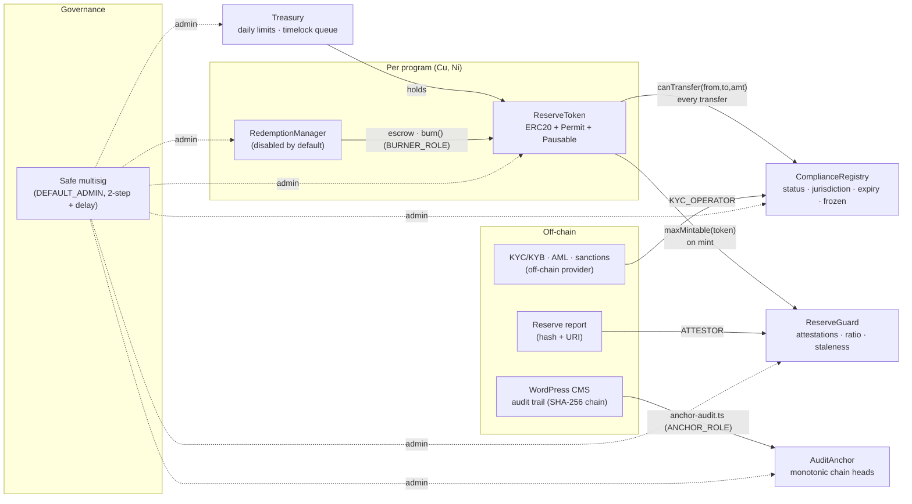

# ReserveChain.io — Smart Contracts (testnet only)

> ReserveChain is currently in development. No tokens are being offered or sold through this website. Registration of interest does not constitute an investment, token purchase, asset reservation, price reservation, token allocation or entitlement to participate in any future offering. Any future availability will be subject to the final Swiss corporate and legal structure, definitive offering documentation, asset verification, custody arrangements, jurisdictional eligibility, KYC/KYB, sanctions screening and final approval.
>
> ReserveChain does not currently intend to offer tokens to residents of, or persons located in, the EU/EEA.

This package holds the **proposed** on-chain layer for the ReserveChain programs (Cu 29 — Copper Powder, Ni 28 — Nickel Wire). It targets **testnets only** (Ethereum Sepolia by default, Polygon Amoy optional). Mainnet deployment is not performed and is blocked by the deploy tooling.

**Nothing economic is hard-coded.** Price, supply, asset-to-token ratio, redemption thresholds, allocations and discounts are configuration inputs. They default to unset, zero or disabled. **Minting is fail-closed in the token itself.** It needs either an enabled reserve guard that permits the amount, or an explicit static-cap mode. With the shipped configs **minting is blocked**: the guard is enabled but the ratio is unset. **Redemption is disabled** as well.

Stack: Hardhat 2 · TypeScript · Solidity 0.8.28 (optimizer 200 runs, `cancun`) · OpenZeppelin Contracts 5.4 · ethers v6 · solidity-coverage · hardhat-gas-reporter.

---

## 1. Architecture



| Contract | Purpose | Defaults |
|---|---|---|
| `ReserveToken` | ERC-20 + EIP-2612 permit + pause. Name, symbol, decimals and cap come from the constructor/config. It has an optional compliance hook and an optional reserve-guard mint check. Burning is restricted to BURNER_ROLE. Admins can recover ERC-20 tokens and set `programId` and `document(uri, hash)` metadata. | **mint blocked** (no guard, cap 0, `mintingEnabled=false`) · hooks off until wired |
| `ComplianceRegistry` | Stores one record per address: `{status: None/Pending/Approved/Rejected/Revoked, jurisdiction bytes2, expiry, frozen}`. Also holds the blocked-jurisdiction set, which config seeds with EU/EEA codes, and exposes `canTransfer`. It has batch setters. | empty |
| `ReserveGuard` | Attestors post `(programId, units, reportHash, uri, asOf)`. `maxMintable(token) = units × tokensPerUnit − totalSupply`. | **ratio unset, staleness window unset ⇒ 0** |
| `RedemptionManager` | Flow: request (escrow) → approve (burn and record the fulfilment ref) / reject (return) / cancel (requester). The module has min/max thresholds and can be paused. | **disabled**, thresholds unset |
| `Treasury` | Role-controlled ERC-20 holder. It enforces a daily limit per token and has an optional timelock queue for large withdrawals, with an optional grace period. | limit 0 ⇒ no immediate withdrawals · queue off |
| `AuditAnchor` | Anchors `(chainHead, seq, uri)` from the CMS audit trail. `seq` must strictly increase. Getters: `latest()`, `getAnchor(seq)`, `verify(seq, head)`. | empty |

Every contract uses `AccessControlDefaultAdminRules`. Each contract has exactly one `DEFAULT_ADMIN`, and changing it is a two-step begin/accept with an enforced delay.

### Eligibility rule (ComplianceRegistry)
An address is eligible when **all** of these hold:
- `status == Approved`
- `!frozen`
- `expiry == 0 || now < expiry`
- `jurisdiction ∉ blocked`

`canTransfer` requires both non-zero sides to be eligible. Mints screen only the recipient and burns screen only the sender. System contracts that hold tokens (RedemptionManager, Treasury) are registered as `Approved` with jurisdiction `0x0000` by the deploy script.

### Fail-closed minting (ReserveToken)
`mint` succeeds only in one of two explicitly configured modes. In every other state it reverts with `MintingDisabled`. The default state is blocked.

| Mode | Condition | Bound |
|---|---|---|
| **(a) Reserve mode** | `reserveGuardEnabled == true` | `amount ≤ guard.maxMintable(token)`, plus `supplyCap` if it is non-zero |
| **(b) Static-cap mode** | guard disabled **and** `supplyCap != 0` **and** `mintingEnabled == true` | `totalSupply ≤ supplyCap` |

- `mintingEnabled` defaults to `false`. Only `DEFAULT_ADMIN_ROLE` can change it, through `setMintingEnabled(bool)`, which emits `MintingEnabledUpdated`.
- While the guard is enabled, `mintingEnabled` is ignored and the guard alone decides.
- Setting the cap back to 0, or `mintingEnabled` back to false, blocks static-cap mode again.
- A `MINTER_ROLE` holder can therefore never mint an unlimited amount.

### Reserve-gated minting (ReserveGuard)
`maxMintable` is **fail-closed**. It returns 0 unless all four of these are configured:
1. The token is bound to a program id (`bindToken`).
2. `tokensPerUnit[programId] > 0`.
3. `maxAttestationAge > 0`.
4. The latest attestation's `asOf` is inside the window.

`units` is the attested reserve quantity in the program's reporting unit. `tokensPerUnit` is expressed in token base units, so fractional ratios can be expressed through token decimals. Attestations are statements posted by an authorised key. They are **not** a confirmed Proof of Reserves.

---

## 2. Role matrix

| Contract | Role | Capabilities | Intended holder |
|---|---|---|---|
| all | `DEFAULT_ADMIN_ROLE` | grant/revoke every role, admin handover (2-step + delay) | Safe multisig |
| ReserveToken | `MINTER_ROLE` | `mint` (subject to pause, cap, compliance, guard) | Issuance ops key / Safe module |
| | `BURNER_ROLE` | `burn` (own balance), `burnFrom` (needs allowance) | **RedemptionManager only** |
| | `PAUSER_ROLE` | `pause` / `unpause` all movements | Incident-response signer(s) |
| | `COMPLIANCE_ADMIN_ROLE` | `setComplianceRegistry`, `setComplianceEnabled` | Compliance officer / Safe |
| | `TREASURY_ROLE` | `recoverERC20` | Treasury ops |
| | `DEFAULT_ADMIN_ROLE` | `setSupplyCap`, `setProgramId`, `setDocument`, `setReserveGuard`, `setReserveGuardEnabled` | Safe |
| ComplianceRegistry | `KYC_OPERATOR_ROLE` | `setRecord(s)`, `setFrozen(Batch)` | KYC back-office bot |
| | `JURISDICTION_ADMIN_ROLE` | `setJurisdictionsBlocked` | Compliance officer |
| ReserveGuard | `ATTESTOR_ROLE` | `postAttestation` | Attestation signer (planned independent party) |
| | `GUARD_ADMIN_ROLE` | `setTokensPerUnit`, `setMaxAttestationAge`, `bindToken` | Safe |
| RedemptionManager | `REDEMPTION_OPERATOR_ROLE` | `approve`, `reject` | Redemption ops |
| | `CONFIG_ADMIN_ROLE` | `setEnabled`, `setThresholds` | Safe |
| | `PAUSER_ROLE` | `pause` / `unpause` | Incident-response signer(s) |
| | requester (anyone) | `request` (when enabled), `cancel` own pending | Eligible holders |
| Treasury | `TREASURER_ROLE` | `withdraw`, `queueWithdrawal`, `executeWithdrawal`, `cancelWithdrawal` | Treasury ops |
| | `LIMIT_ADMIN_ROLE` | `setDailyLimit`, `setTimelockDelay`, `setGracePeriod`, `cancelWithdrawal` | Safe |
| | `PAUSER_ROLE` | `pause` / `unpause` | Incident-response signer(s) |
| AuditAnchor | `ANCHOR_ROLE` | `anchor` | CMS anchoring bot key |

---

## 3. Quick start (local)

```bash
cd contracts
npm install
npm run compile
npm test                 # 83 tests
npm run coverage         # 100% lines/statements/functions
npm run gas              # gas report
npm run deploy:hardhat   # in-process network, uses config/localhost.json

# persistent local chain
npx hardhat node                          # terminal 1
npm run deploy:localhost                  # terminal 2 -> deployments/localhost.json
WP_URL=http://localhost:8088 npm run anchor:localhost
```

`config/localhost.json` grants operational roles to the local `deployer` account so that every flow can be exercised by hand. The tokenomics fields in it are still unset.

---

## 4. Configuration

Configs live in `config/<network>.json`. The in-process `hardhat` network uses `config/localhost.json`, and the `DEPLOY_CONFIG=path` env var overrides the file. Keys starting with `_` are comments and are ignored. Role lists accept addresses, or the literal `"deployer"`.

| Field | Meaning | Shipped default |
|---|---|---|
| `adminTransferDelaySeconds` | delay on every DEFAULT_ADMIN handover | 0 local · 86400 testnet examples |
| `safeMultisig` | Safe that receives DEFAULT_ADMIN (two-step) | `null` |
| `revokeDeployerWiringRoles` | revoke the temporary roles the deployer took for wiring | false local · true testnet |
| `compliance.enabled` | turn on the token transfer hook | `true` |
| `compliance.blockedJurisdictions` | ISO alpha-2 codes (EU/EEA per SPEC) | 30 EU/EEA codes |
| `compliance.kycOperators` / `jurisdictionAdmins` | role holders | `[]` |
| `reserveGuard.enabled` | turn on the mint check | `true` |
| `reserveGuard.maxAttestationAgeSeconds` | staleness window | **`null` (minting blocked)** |
| `reserveGuard.attestors` / `guardAdmins` | role holders | `[]` |
| `treasury.timelockDelaySeconds` / `gracePeriodSeconds` | queue settings | `null` (queue off) |
| `tokens[].name/symbol/decimals` | ERC-20 metadata (TESTNET placeholders) | `tCU`/`tNI`, 18 |
| `tokens[].supplyCap` | static cap, whole tokens | **`null` (none)** |
| `tokens[].mintingEnabled` | static-cap-mode switch. It only works with a non-null `supplyCap`, and is ignored while the guard is enabled | **`false`** |
| `tokens[].programId` | label (keccak256) or bytes32 | `RC-PROGRAM-CU` / `-NI` |
| `tokens[].document.uri/hash` | offering doc reference | `null` |
| `tokens[].tokensPerUnit` | whole tokens per reserve unit | **`null` (minting blocked)** |
| `tokens[].roles.*` | minters, burners, pausers, complianceAdmins, treasuryOperators | `[]` |
| `tokens[].redemption.enabled/minAmount/maxAmount` | redemption module | **`false` / `null` / `null`** |
| `tokens[].treasuryDailyLimit` | immediate treasury limit, whole tokens | **`null` (0)** |

`.env` (copy from `.env.example`, never commit it):
- `SEPOLIA_RPC_URL`, `AMOY_RPC_URL`, `DEPLOYER_PRIVATE_KEY`, `ETHERSCAN_API_KEY`
- `WP_URL`, `WP_USER`, `WP_APP_PASSWORD`

---

## 5. Deployment runbook (Sepolia)

1. **Prepare**
   - Create a fresh deployer EOA used only for testnet deployment, and fund it with Sepolia ETH.
   - Fill in `.env`.
   - Run `cp config/sepolia.example.json config/sepolia.json`.
   - Fill in the role addresses and `safeMultisig`. Leave the tokenomics fields `null` unless written approval exists.
2. **Check:** `npm test && npm run coverage`. Review the config diff with a second person (four-eyes).
3. **Deploy:** `npm run deploy:sepolia`. The script:
   - checks the chain id: it refuses non-testnets unless `ALLOW_MAINNET=I_HAVE_WRITTEN_AUTHORIZATION` is set, and warns even then;
   - deploys the shared contracts, then a token and a RedemptionManager per program;
   - seeds the blocked jurisdictions and registers the system holders;
   - wires the hooks and grants the configured roles;
   - revokes its own temporary wiring roles;
   - calls `beginDefaultAdminTransfer(safe)` on every contract;
   - writes `deployments/sepolia.json`, which includes the constructor args and the config SHA-256.
4. **Verify:** `npm run verify:sepolia` (Etherscan API v2).
5. **Hand over admin.** See §6.
6. **Record.** Publish the addresses to the CMS (`/config` → `network.token_address`). Archive `deployments/sepolia.json` together with the config hash.

---

## 6. Multisig handover procedure

`AccessControlDefaultAdminRules` enforces one admin, a two-step transfer and a delay.

1. The deploy script calls `beginDefaultAdminTransfer(safe)` on all 8 contracts, which is possible because `safeMultisig` is set. Alternatively, the current admin calls it manually.
2. Wait `adminTransferDelaySeconds`. To check progress, run `npx hardhat run scripts/admin-status.ts --network sepolia`. It shows `pending=<safe> (acceptable now)`.
3. In the Safe UI, open Transaction Builder. Batch `acceptDefaultAdminTransfer()` on every contract address from `deployments/sepolia.json`, collect the threshold signatures, and execute.
4. Run `admin-status.ts` again. Every contract should show `admin=<safe> pending=none`. The deployer no longer holds DEFAULT_ADMIN.
5. If the handover was started to a wrong address, the current admin calls `cancelDefaultAdminTransfer()`.
6. Changing the delay later uses `changeDefaultAdminDelay`, which is itself delayed.

---

## 7. Token administration procedures

All administrative actions should be executed from the Safe, or from a role key named in the role matrix. Record every action in the CMS audit trail.

### Mint
Prerequisites while the guard is enabled:
1. `guard.bindToken(token, programId)`
2. `guard.setTokensPerUnit(programId, ratio)`, which requires written approval
3. `guard.setMaxAttestationAge(window)`
4. A fresh `postAttestation`

Static-cap mode is the alternative, used only with written approval. The Safe disables the guard, calls `token.setSupplyCap(cap)` with a non-zero cap, then calls `token.setMintingEnabled(true)`.

In either mode, the recipient must be `Approved` in the registry. Then call `token.mint(to, amount)` from a MINTER_ROLE key. To check headroom first, call `guard.maxMintable(token)`. If neither mode is configured, the call reverts with `MintingDisabled`.

To stop minting quickly, disable static-cap mode with `setMintingEnabled(false)`, or unset the guard ratio. `pause()` stops all movements.

### Burn
Burns happen only through the RedemptionManager approval path. `burnFrom` exists for exceptional, holder-consented burns: it needs the holder's ERC-20 approval and BURNER_ROLE. There is no forced burn.

### Pause / unpause
`token.pause()` stops every movement: transfers, mints and burns. `redemption.pause()` and `treasury.pause()` are scoped to their own modules. Unpause only after the incident review is signed off.

### Compliance updates
- To onboard a holder, call `registry.setRecord(addr, Approved, "CH"→0x4348, expiry)`, or use `setRecordsBatch` for bulk updates.
- To revoke, use status `Revoked`. For an emergency, use `setFrozen(addr, true)` (or `setFrozenBatch`).
- Blocked jurisdictions change through `setJurisdictionsBlocked(codes, bool)`.
- Disabling the hook (`token.setComplianceEnabled(false)`) requires Safe approval and should be exceptional.

### Attestation
1. The attestor computes the SHA-256 of the report and publishes the report at a URI.
2. The attestor calls `postAttestation(programId, units, reportHash, uri, asOf)`. `asOf` must be later than the previous attestation's and not in the future.
3. Post a new attestation before `maxAttestationAge` elapses. Otherwise minting stops.

### Redemption operations (only after written authorisation)
1. The Safe sets thresholds with `setThresholds`, then calls `setEnabled(true)`.
2. The holder calls `approve(rm, amount)` and then `request(amount)`.
3. Operators review the request off-chain (KYC, sanctions, fulfilment), then call either:
   - `approve(id, fulfilmentRefHash)`, which burns the escrow; or
   - `reject(id, reasonHash)`, which returns it.
4. The holder may `cancel(id)` while the request is pending.
5. `totalEscrowed` must always equal the RedemptionManager's token balance, minus any tokens sent to it by mistake.

### Treasury
- `setDailyLimit(token, limit)` enables immediate withdrawals up to `limit` per UTC day.
- Withdrawals above the limit go through the queue: `queueWithdrawal`, then wait `timelockDelay`, then `executeWithdrawal`. Either role can call `cancelWithdrawal` during the delay.

### Audit anchoring
`WP_URL=… npm run anchor:sepolia`:
1. Reads `GET /wp-json/rc/v1/audit/head`.
2. Anchors `0x+chain_head` at `seq`. It is idempotent: if the head is already anchored, it does nothing.
3. If `WP_USER`/`WP_APP_PASSWORD` are set, it posts `{seq, chain_head, network, tx_hash}` to `/wp-json/rc/v1/audit/anchor` (capability `rc_anchor_audit`).
4. `DRY_RUN=true` validates without sending a transaction.

Schedule it with cron or CI, for example daily.

### Incident response
1. **Contain.**
   - A PAUSER calls `token.pause()`, plus `redemption.pause()` and `treasury.pause()`.
   - A KYC_OPERATOR freezes the affected addresses.
   - A Treasury role holder cancels queued withdrawals.
2. **Assess.** Snapshot events and balances, then anchor the current CMS audit head.
3. **Rotate.** The Safe revokes the compromised role keys and grants new ones. If needed, unbind the guard or unset the ratio to stop minting.
4. **Recover.** Unpause only after the root cause is fixed and two signers have reviewed the fix. Publish a post-mortem.
5. **If the Safe itself is compromised:** the admin delay leaves a window to notice a `beginDefaultAdminTransfer`. Monitor `DefaultAdminTransferScheduled` events.

---

## 8. Quality gates

| Gate | Command | Result |
|---|---|---|
| Compile | `npm run compile` | ✓ solc 0.8.28, optimizer on |
| Tests | `npm test` | 83 passing |
| Coverage | `npm run coverage` | 100% statements / lines / functions, ~95% branches |
| Types | `npm run typecheck` | ✓ |
| Gas | `npm run gas` | see `gas-report.txt` |
| Static analysis | `npm run slither` | 3 informational / false-positive findings (see SECURITY.md) |

See [SECURITY.md](./SECURITY.md) for the threat model and known limitations. An independent audit is required before any non-test use.
