# ReserveChain.io — System Architecture

> **Status:** Proposed architecture — subject to final approval by ReserveChain.
> **Applies to:** Contest entry demo (local Docker) and the proposed Staging / Production platform.
> **Source of truth:** `SPEC.md` at the repository root.

> **Mandatory disclosure.** ReserveChain is currently in development. No tokens are being offered or sold through this website. Registration of interest does not constitute an investment, token purchase, asset reservation, price reservation, token allocation or entitlement to participate in any future offering. Any future availability will be subject to the final Swiss corporate and legal structure, definitive offering documentation, asset verification, custody arrangements, jurisdictional eligibility, KYC/KYB, sanctions screening and final approval.
>
> **EU/EEA notice.** ReserveChain does not currently intend to offer tokens to residents of, or persons located in, the EU/EEA.

---

## 1. Purpose and scope

ReserveChain.io is a proposed turnkey platform for the registration, evidencing and (subject to authorization) tokenization of two industrial-metal programs:

| Program | Identity tile | Asset form | Status |
|---|---|---|---|
| Copper Powder | **Cu 29** | Ultra-high-purity copper powder (specifications **[To be provided by ReserveChain]**) | Proposed |
| Nickel Wire | **Ni 28** | High-purity nickel wire (specifications **[To be provided by ReserveChain]**) | Proposed |

This document describes the system context, logical containers, data flows, environments, proposed infrastructure, security architecture, the on-chain / off-chain boundary, and the audit-trail anchoring design.

Design principles:

1. **Evidence first, token second.** The off-chain registry (lots, batches, containers, coils, certificates, custody, valuations, insurance, reserve reports) is the system of record. Tokens, if ever issued, are a projection of verified registry state — never the other way round.
2. **Nothing invented.** Every field may be `null`. Every factual claim carries a Claim Status (`proposed`, `in_development`, `pending_verification`, `verified`, `not_applicable`).
3. **Off by default.** Wallet, purchase, Proof of Reserves, redemption and minting are feature-flagged **off** and require explicit, logged authorization to enable.
4. **Tamper evidence.** All material changes are written to a hash-chained, append-only audit log that can be anchored on-chain.
5. **Separation of duties.** Four-eyes approval for publication; role-based access; on-chain admin intended to be a multisig.
6. **Testnet only** in this engagement. Mainnet deployment is never performed by the contractor.

---

## 2. System context (C4 level 1)

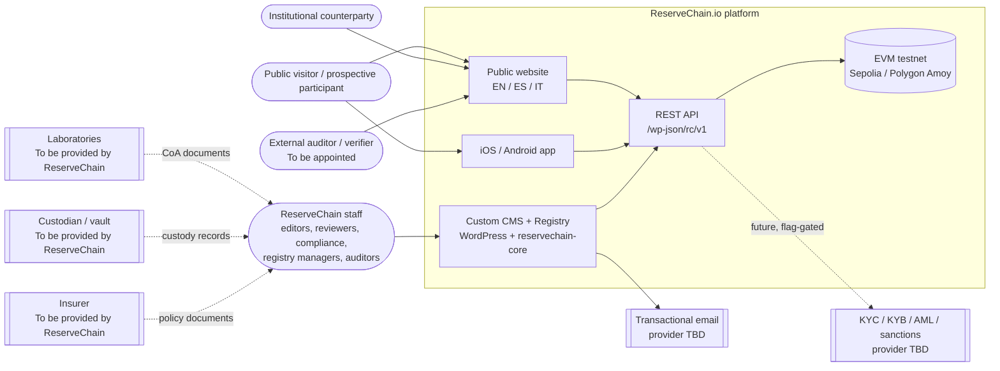

External parties (laboratories, custodians, insurers, KYC providers, auditors) are **not yet appointed**. They are shown as integration points only; their identities are **[To be provided by ReserveChain]**.

---

## 3. Containers (C4 level 2)

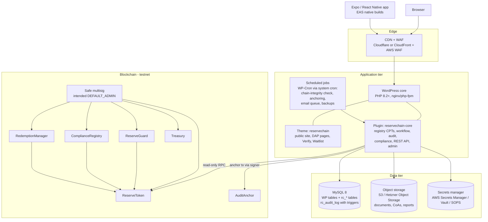

| Container | Technology | Responsibility | Repository path |
|---|---|---|---|
| Public website | WordPress theme `reservechain` (PHP templates, TypeScript UI modules) | All public sections, DAP viewer, client-side Verify, waitlist form, legal notices, i18n EN/ES/IT | `wordpress/themes/reservechain/` |
| CMS + Registry | WordPress plugin `reservechain-core` | Registry CPTs, Digital Asset Passports, four-eyes workflow, audit log, compliance controls, site modes, module flags, REST API, admin UI | `wordpress/plugins/reservechain-core/` |
| REST API | WP REST, namespace `/wp-json/rc/v1` | Public read-only endpoints + authenticated member endpoints (see SPEC) | inside plugin |
| Database | MySQL 8 (InnoDB, utf8mb4) | WP core tables, `rc_*` tables, append-only `rc_audit_log` | migrations in plugin |
| Document store | S3-compatible object storage (private bucket, signed URLs) | Certificates of analysis, custody, insurance, reserve reports, whitepaper | infra |
| Smart contracts | Solidity, Hardhat, OpenZeppelin v5 | Token, compliance, reserve guard, redemption, treasury, audit anchor | `contracts/` |
| Mobile app | Expo (React Native, TypeScript), EAS Build | Programs, passports, verify, account, MFA, notifications; wallet/holdings inactive | `mobile/` |
| Local stack | Docker Compose (WordPress, MySQL, phpMyAdmin) | Developer environment and contest demo | `docker-compose.yml` |

---

## 4. Data flows

### 4.1 Public web read path

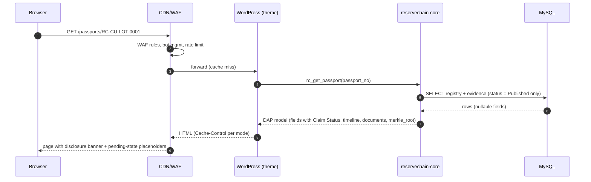

Only records in **Published** workflow state are ever exposed publicly. Fields marked *private* in the CMS schema are never serialised to public endpoints.

### 4.2 CMS editorial and registry write path (four-eyes)

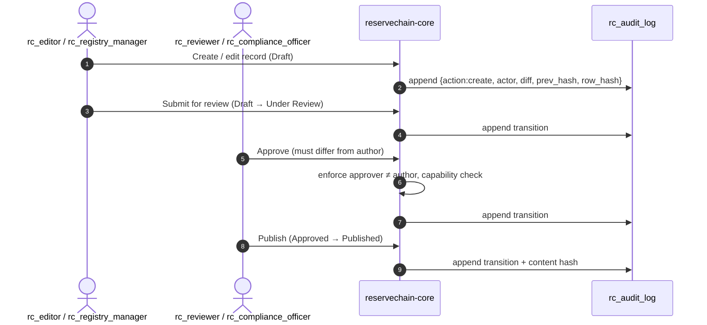

### 4.3 Client-side document verification

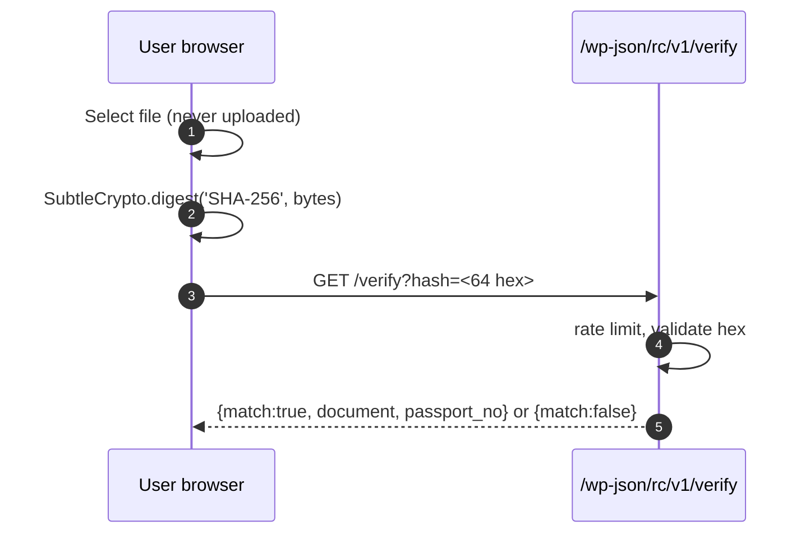

### 4.4 Waitlist registration

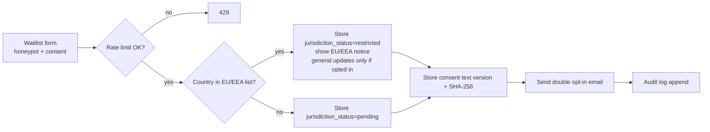

Registration of interest creates **no** entitlement, allocation or reservation of any kind (see mandatory disclosure).

### 4.5 Mobile app

The app is a thin client of the REST API. On launch it calls `GET /config` and renders only modules whose flags are `true`. Wallet, holdings and transactions endpoints return `{enabled:false, items:[]}` until authorized. Tokens are stored in the platform secure store (iOS Keychain / Android Keystore via `expo-secure-store`). MFA is TOTP (RFC 6238).

### 4.6 Chain interaction

The CMS **reads** chain state (token address, total supply, paused state, latest reserve attestation) via a configured RPC endpoint for display. The only CMS-originated **write** is the optional audit anchor transaction (`AuditAnchor.anchor`), signed by a dedicated low-privilege anchor key held in the secrets manager. All privileged token operations (mint, burn, pause, role grants, compliance updates, attestation posts) are performed by role-holders via the intended Safe multisig, outside the CMS.

---

## 5. Environments — mandatory separation

| Aspect | Development | Staging | Production |
|---|---|---|---|
| Purpose | Local build, unit tests | UAT, owner acceptance, independent verification, restore drills | Public site |
| Hosting | Docker Compose on developer machine | Same topology as Production, smaller sizing | Proposed managed or containerised hosting (§6) |
| Domain | `localhost` | `staging.reservechain.io` (proposed), HTTP basic-auth + IP allow-list, `noindex` | `reservechain.io` |
| Database | Local MySQL container, synthetic data | Separate RDS instance, anonymised copy only | Separate RDS instance, Multi-AZ (proposed) |
| Object storage | Local volume | Separate bucket | Separate bucket, versioning + Object Lock (proposed) |
| Secrets | `.env` (never committed; `.env.example` provided) | Secrets manager, staging path | Secrets manager, production path, separate KMS key |
| Chain | Hardhat local network | Sepolia (default) / Polygon Amoy | **Testnet only during this engagement.** Mainnet is out of scope and requires separate written authorization by ReserveChain |
| Email | Mailpit / log driver | Provider sandbox | Provider production (SPF, DKIM, DMARC) |
| Site mode | any | `prelaunch` / `waitlist_only` | per owner decision (default `prelaunch`) |
| Access | Developers | Developers, ReserveChain reviewers | ReserveChain staff only; contractor access revoked at handover |

Rules: no production data flows to lower environments except anonymised; no shared credentials between environments; each environment has its own WordPress salts, API HMAC secret, anchor signer key, and RPC key; promotion is always Dev → Staging → Production via CI.

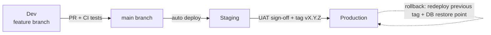

---

## 6. Infrastructure proposal

Two options are proposed. The final selection is **subject to approval by ReserveChain**; both are documented so that the choice can be made on cost, data-residency and operational preference. Region selection is **[To be decided by ReserveChain]** (a Swiss or EU-adjacent region would be a natural candidate given the proposed Swiss structure, but this is not assumed).

### Option A — AWS (containerised)

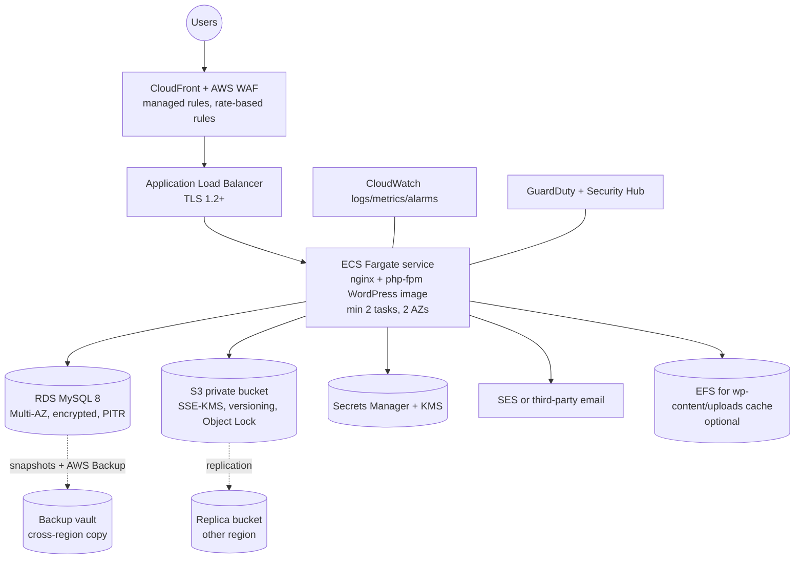

### Option B — Hetzner + Cloudflare (cost-efficient)

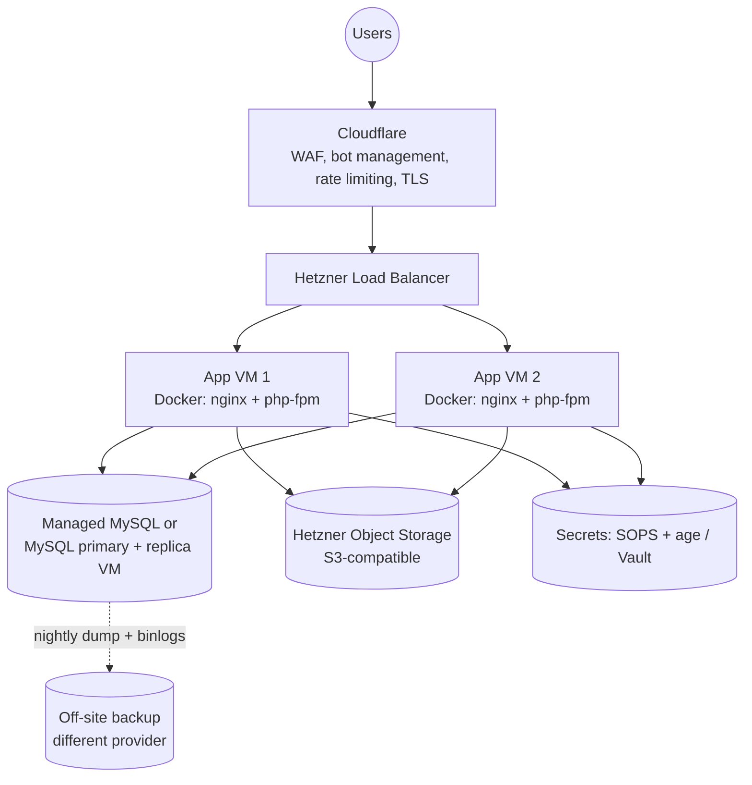

### Option C — Managed WordPress hosting

A managed WordPress host (e.g. a provider offering staging environments, daily backups and WAF) is acceptable provided it supports: custom MySQL triggers (required for the append-only audit log), PHP 8.2+, system cron, SSH/WP-CLI, separate staging, and private object storage. Many managed hosts restrict `CREATE TRIGGER`; this must be confirmed before selection. If triggers are unavailable the plugin falls back to application-level enforcement plus hash-chain verification, which is weaker and must be accepted in writing.

### Common components

| Concern | Proposal |
|---|---|
| CI/CD | GitHub Actions (or GitLab CI) owned by ReserveChain organisation: lint, PHPUnit, Hardhat tests, Playwright smoke tests, image build, deploy to Staging, manual approval to Production |
| Container image | Immutable, tagged by git SHA and semver; scanned (Trivy) before push |
| DNS | Cloudflare or Route 53, DNSSEC enabled, registrar lock |
| Email | Transactional provider TBD; SPF, DKIM, DMARC `p=quarantine` → `reject` |
| Monitoring | Uptime checks, APM, log aggregation, alerting to on-call (§7.10) |
| Analytics | Privacy-respecting analytics (e.g. self-hosted Plausible/Matomo) — consent-aware; provider **[To be decided by ReserveChain]** |

---

## 7. Security architecture

A fuller treatment is in [`SECURITY.md`](SECURITY.md). Summary:

### 7.1 Identity and access (RBAC)

| Role | Purpose | Key capabilities |
|---|---|---|
| `administrator` | Platform owner (ReserveChain) | All, incl. `rc_manage_settings`, `rc_authorize_modules`, `rc_anchor_audit`; restricted to named owner accounts |
| `rc_editor` | Content authoring | Edit pages/content, upload; `rc_submit` |
| `rc_registry_manager` | Registry data | Edit registry entities, `rc_manage_registry`, `rc_submit`; cannot publish |
| `rc_reviewer` | Editorial review | `rc_approve` (never own work), `rc_view_audit` |
| `rc_compliance_officer` | Compliance gate | `rc_approve`, `rc_publish`, `rc_archive`, `rc_manage_compliance`, `rc_manage_waitlist`, `rc_view_audit` |
| `rc_auditor` | Read-only oversight | Read registry incl. drafts; `rc_view_audit` (view, verify chain, export) |

Full matrix in [`CMS-STRUCTURE.md`](CMS-STRUCTURE.md#6-role--capability-matrix).

### 7.2 Authentication

- MFA (TOTP, RFC 6238) **mandatory** for all `rc_*` roles and administrators; optional-then-enforced for member accounts.
- Passwords: minimum 12 characters, breached-password check (k-anonymity range API, optional), Argon2id/bcrypt via WP core hashing.
- API: HMAC-signed bearer tokens (1 h) + rotating refresh tokens; refresh token reuse detection revokes the family.
- Login throttling and lockout with exponential back-off; generic error messages.

### 7.3 Sessions

Secure, HttpOnly, SameSite=Lax cookies; idle timeout 30 min for admin roles; absolute timeout 12 h; session revocation on role change or password reset; concurrent session listing for admins.

### 7.4 Transport and browser security

| Control | Setting |
|---|---|
| TLS | 1.2+ only, modern ciphers, automatic certificates |
| HSTS | `max-age=63072000; includeSubDomains; preload` (after staging validation) |
| CSP | `default-src 'self'`; scripts with nonces; `frame-ancestors 'none'`; `object-src 'none'`; `connect-src` limited to API + configured RPC |
| Other headers | `X-Content-Type-Options: nosniff`, `Referrer-Policy: strict-origin-when-cross-origin`, `Permissions-Policy` minimal, `Cross-Origin-Opener-Policy: same-origin` |
| Cookies | `Secure; HttpOnly; SameSite` |

### 7.5 Upload handling

Allow-list of MIME types (PDF, PNG, JPEG, CSV, JSON); magic-byte validation; maximum size; antivirus scan (ClamAV sidecar or provider scanning) before a document leaves quarantine; SHA-256 computed server-side at ingest and stored immutably; files stored in a private bucket and served via short-lived signed URLs; filenames randomised; PDF metadata preserved for evidence.

### 7.6 Rate limiting and abuse

Edge rate limits (WAF) plus application limits per IP / per account on `/waitlist`, `/verify`, `/auth/*`, `/support`. Waitlist honeypot field; optional privacy-friendly challenge (e.g. Cloudflare Turnstile) — **subject to approval**.

### 7.7 Secrets and environment variables

No secrets in the repository. `.env.example` templates document every variable. Runtime secrets (DB credentials, WP salts, API HMAC key, SMTP credentials, RPC keys, anchor signer key) are read from the secrets manager and injected as environment variables. Rotation procedures are in `SECURITY.md`. Private keys for contract admin roles are **never** held by the platform; they belong to the multisig signers.

### 7.8 Backups — 3-2-1

Three copies, two media/providers, one off-site and immutable. Details, RPO/RTO targets and restore drills in [`BACKUP-DR.md`](BACKUP-DR.md).

### 7.9 Logging and monitoring

Application logs (structured JSON), web/WAF logs, DB slow-query log, audit log (business events, tamper-evident), uptime probes, chain-integrity verification job (daily), anchoring job status, certificate expiry, backup success alerts.

### 7.10 Vulnerability management

Dependabot/Renovate for PHP, npm and Solidity dependencies; container image scanning; WPScan against plugins/themes; static analysis (PHPStan, Slither for Solidity); annual (or pre-launch) third-party penetration test and smart-contract audit — **auditor to be appointed by ReserveChain**. Patch SLAs: critical 72 h, high 7 days, medium 30 days.

### 7.11 Incident response

Defined severities, on-call contact list **[To be provided by ReserveChain]**, runbook for site-mode switch to `maintenance`, contract `pause()` via multisig, credential rotation, evidence preservation (audit log export + anchor), and post-incident review. See `SECURITY.md §9`.

---

## 8. On-chain / off-chain boundary

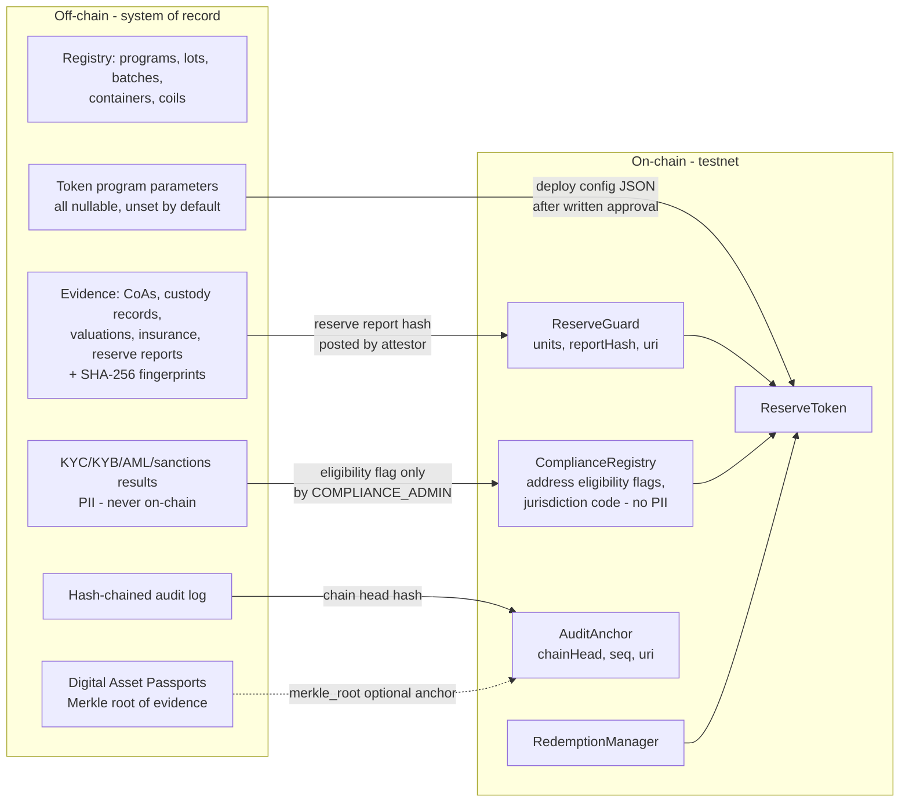

| Data | Where | Rationale |
|---|---|---|
| Personal data (names, emails, KYC documents) | Off-chain only | GDPR / Swiss FADP data-minimisation; immutability incompatible with erasure rights |
| Eligibility flags (KYC status enum, jurisdiction code, frozen, expiry) | On-chain (ComplianceRegistry) | Needed for transfer-time enforcement; no PII |
| Evidence documents | Off-chain (private storage) | Size, confidentiality |
| Evidence fingerprints (SHA-256) and Merkle roots | Off-chain, optionally anchored on-chain | Public verifiability without disclosure |
| Reserve attestation (units, report hash, URI) | On-chain (ReserveGuard), posted by an attestor role | Enables reserve-gated mint cap; the attestor identity is **[To be provided by ReserveChain]** |
| Token parameters (name, symbol, cap, ratio, thresholds) | Deploy config + CMS token program record | Never hard-coded; default unset ⇒ features disabled |

**Reserve-gated minting.** When the `ReserveGuard` is enabled on the token, `ReserveToken.mint` reverts if `amount > ReserveGuard.maxMintable(token)`, where the headroom is `attestedUnits × tokensPerUnit − totalSupply`. The guard is fail-closed: it returns zero unless the token is bound to a program, `tokensPerUnit` is set, a maximum attestation age is set and a fresh attestation exists — all unset by default. A static supply cap (if configured) and the compliance hook (recipient eligibility) apply in addition. This is a technical control only; it does not itself constitute Proof of Reserves, which would depend on independent attestation arrangements that are **not yet in place**.

---

## 9. Audit-trail anchoring design

### 9.1 Hash chain

Each row of `wp_rc_audit_log` (implemented in `reservechain-core/includes/class-audit-log.php` and `class-install.php`):

| Column | Type | Notes |
|---|---|---|
| `id` | BIGINT UNSIGNED AUTO_INCREMENT | Sequence number (`seq`) |
| `created_at` | DATETIME(6) | Server time |
| `actor_id`, `actor_login`, `actor_role` | BIGINT / VARCHAR | WP user (0 = system) and role at time of action |
| `ip_hash` | CHAR(64) | HMAC-SHA-256 of IP with site salt (no raw IPs stored) |
| `action` | VARCHAR(64) | e.g. `plugin.activated`, `system.migrated`, `auth.login_failed`, `media.uploaded`, workflow transitions, option changes |
| `object_type` / `object_id` | VARCHAR / BIGINT | Target |
| `summary` | VARCHAR(512) | Human-readable description |
| `data` | LONGTEXT (JSON) | Context; no secrets |
| `prev_hash` | CHAR(64) | `row_hash` of previous row (genesis = 64 × `0`) |
| `row_hash` | CHAR(64), UNIQUE | `SHA-256(join(0x1F, prev_hash, created_at, actor_id, actor_login, actor_role, ip_hash, action, object_type, object_id, summary, data))` |

Appends are serialised with a MySQL named lock so concurrent requests cannot fork the chain. MySQL `BEFORE UPDATE` and `BEFORE DELETE` triggers on the table execute `SIGNAL SQLSTATE '45000'`, so the table is append-only even for the application DB user; trigger presence is checked via `information_schema.TRIGGERS` and surfaced in the admin dashboard. In production the application DB user should additionally be granted only `INSERT, SELECT` on this table and no `TRIGGER`/`DROP` privilege (where the host permits per-table grants). Anchors are recorded in `wp_rc_audit_anchor (seq, chain_head, network, tx_hash, anchored_by)`.

### 9.2 Verification

Admin → ReserveChain → Audit Log → **Verify chain integrity** recomputes every `row_hash` from genesis and reports the first broken link, if any. A scheduled job runs the same verification daily and alerts on failure. Auditors can export the log as JSONL with hashes for independent recomputation.

### 9.3 On-chain anchoring

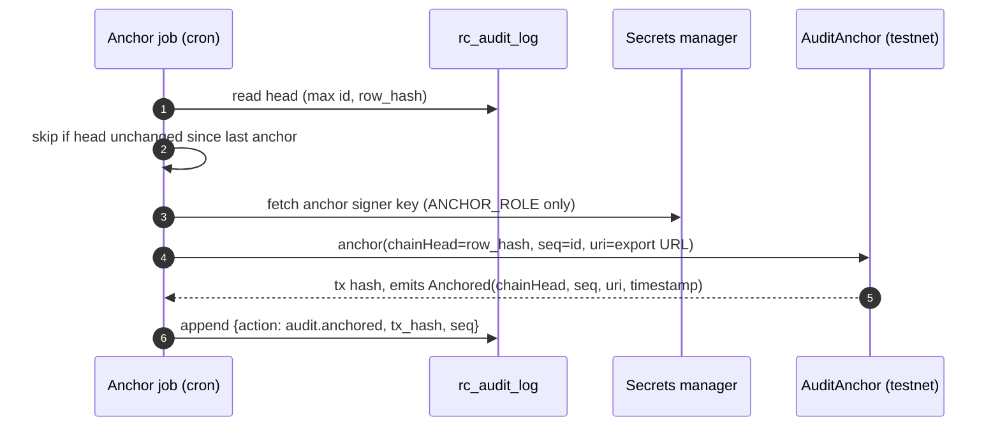

- Anchoring cadence: configurable (e.g. daily or on demand); **disabled by default** until the network and signer are approved.
- The anchor proves that the audit log up to `seq` existed with that exact content at block time. Any later rewrite of history would produce a different head and fail verification against the anchored value.
- Anchor signer key holds only `ANCHOR_ROLE` on `AuditAnchor`; compromise cannot affect token contracts.
- During this engagement anchoring targets **testnet only**.

---

## 10. Internationalisation

Languages EN (default), ES, IT. UI strings via WordPress gettext (`.po/.mo`) in theme and plugin; registry content supports per-language fields for public text; legal texts (disclosure, EU/EEA notice) require **approved translations by ReserveChain's counsel** — machine translations are marked as drafts until approved. The app consumes `languages` from `/config` and uses i18n bundles.

---

## 11. Open items requiring ReserveChain input

| Item | Placeholder |
|---|---|
| Hosting option and region | [To be decided by ReserveChain] |
| Email, KYC/KYB, analytics providers | [To be decided by ReserveChain] |
| Laboratories, custodians, vaults, insurers | [To be provided by ReserveChain] |
| Multisig signers and threshold | [To be provided by ReserveChain] |
| Reserve attestor | [To be provided by ReserveChain] |
| Smart-contract audit firm, penetration-test firm | [To be appointed by ReserveChain] |
| Legal entity (proposed Swiss structure) | Pending — subject to final approval |
