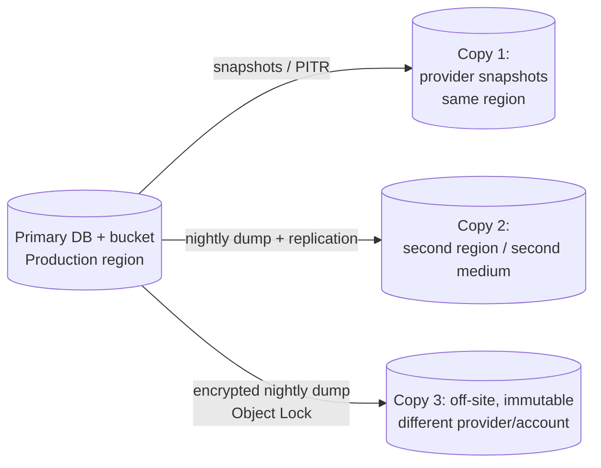

# ReserveChain.io — Backup, Restore and Disaster Recovery

> **Status:** Proposed — subject to final approval. RPO/RTO values below are *proposed targets* for ReserveChain to confirm; they are not commitments of any hosting provider.

> **Mandatory disclosure.** ReserveChain is currently in development. No tokens are being offered or sold through this website. Registration of interest does not constitute an investment, token purchase, asset reservation, price reservation, token allocation or entitlement to participate in any future offering. Any future availability will be subject to the final Swiss corporate and legal structure, definitive offering documentation, asset verification, custody arrangements, jurisdictional eligibility, KYC/KYB, sanctions screening and final approval.

---

## 1. What is backed up

| Data | Location | Criticality | Method |
|---|---|---|---|
| MySQL database (WP + `rc_*` tables incl. audit log) | RDS / managed MySQL | Critical | Automated snapshots + PITR (binlogs) + nightly logical dump (`mysqldump --single-transaction --routines --triggers`) |
| Documents / evidence files | Object storage | Critical | Versioning + Object Lock (compliance mode) + cross-region / cross-provider replication |
| `wp-content` code | Git (ReserveChain org) + container registry | High | Immutable tagged images; repo mirrors |
| Configuration / IaC | Git | High | Repo + mirror |
| Secrets | Secrets manager | Critical | Provider-native replication; break-glass export sealed offline (procedure owned by ReserveChain) |
| Audit-log exports | Object storage (WORM) | Critical | Daily JSONL export with hashes; anchored chain head on testnet |
| Smart-contract deployment records | `contracts/deployments/` in Git | High | Git |
| Mobile signing credentials | EAS / Apple / Google (ReserveChain accounts) | Critical | Provider-managed + offline sealed copy of keystore |

## 2. 3-2-1 strategy



- **3** copies of data (primary + 2 backups),
- on **2** different media/services (managed snapshots + object storage dumps),
- **1** off-site and immutable (separate account/provider with Object Lock; credentials not available to the production app).

All backups encrypted (KMS / age). Backup credentials are write-only from production.

## 3. Schedule and retention (proposed)

| Backup | Frequency | Retention |
|---|---|---|
| PITR (binlogs) | Continuous | 7–35 days |
| DB snapshot | Daily | 35 days |
| Logical dump (off-site) | Daily | 90 days daily, 12 monthly, 7 yearly (subject to counsel's retention policy) |
| Object storage versions | On write | 365 days non-current versions |
| Audit-log JSONL export | Daily | Indefinite (WORM) |

## 4. Targets (proposed)

| Metric | Target |
|---|---|
| RPO (data loss) | ≤ 15 minutes (PITR) |
| RTO (service restore, same region) | ≤ 4 hours |
| RTO (region loss) | ≤ 24 hours |

## 5. Monitoring

Backup job success/failure alerts; daily check that latest dump exists, is non-empty and decrypts; weekly automated restore of the latest dump into an ephemeral instance with `Audit_Log::verify()` run against it.

On the single-server deployment this is implemented by the Operations monitor (`includes/class-monitoring.php`,
see [OPERATIONS.md](OPERATIONS.md)): it alerts when the last successful backup recorded by
`wp rc-ops backup-mark` is older than 26 h or the last run failed; `deploy/restore.sh` (§9.3) is the drill tool.

## 6. Restore procedures

### 6.1 Database point-in-time restore

1. Declare incident; switch Production to `maintenance` (ReserveChain → Settings → Site mode, or `wp option patch update rc_settings site_mode maintenance`).
2. Identify target time (before corruption) from audit log / alerts.
3. Restore RDS to new instance at target time (`aws rds restore-db-instance-to-point-in-time ...`).
4. Verify: row counts; `wp rc audit-verify` (chain integrity) on the restored DB; triggers present (`SELECT * FROM information_schema.TRIGGERS ...`).
5. Compare audit chain head with latest on-chain anchor (`AuditAnchor` events) — entries after the anchor are checked against the daily JSONL export.
6. Point application secrets at the new instance; redeploy current release.
7. Smoke test (TEST-PLAN §13); return to previous site mode; record in incident log.

> **Note on triggers:** a logical restore must include `--triggers`. After restore, load any page (plugin boot re-runs migrations when needed) or re-activate the plugin, which re-creates triggers idempotently; then confirm option `rc_audit_triggers = active` and run `wp rc tamper-test` on Staging to prove UPDATE/DELETE are rejected. On the single-server deployment `deploy/restore.sh` performs and proves all of this automatically (§9.3).

### 6.2 Document restore

Restore object versions from versioned bucket or replica; recompute SHA-256 and confirm it matches `_rc_sha256` for each `rc_document`; any mismatch is a SEV-2.

### 6.3 Full environment rebuild (region / provider loss)

1. Provision infrastructure from IaC in the DR region/provider.
2. Restore DB from off-site dump; restore documents from replica.
3. Restore secrets from replicated secrets manager (or break-glass procedure).
4. Deploy last known-good image tag.
5. Update DNS (low TTL pre-configured, 300 s).
6. Run verification and smoke tests; announce recovery.

## 7. DR drills

| Drill | Frequency | Evidence |
|---|---|---|
| Automated dump restore + integrity verify | Weekly | CI job log |
| Manual PITR restore to Staging | Quarterly | Drill report |
| Full rebuild in DR region | Annually and before launch (M9) | Drill report, timings vs RTO |

## 8. Blockchain considerations

On-chain state (testnet) is not "backed up" — it is replicated by the network. What must be preserved: deployment records (addresses, ABIs, tx hashes, config), role assignments and the multisig configuration. The audit anchor provides an external integrity reference for the off-chain audit log.

## 9. Single-server implementation (Docker host: Oracle Cloud / Hetzner)

The managed-cloud design above is the target architecture. For the current single-server deployment
(`deploy/deploy.sh`, staging + production side by side) the same guarantees are implemented by
`deploy/backup.sh`, `deploy/restore.sh` and `deploy/rollback.sh`, which deploy.sh installs into each environment
directory (`~/reservechain/<env>/`) on every deploy.

### 9.1 What a backup contains

One encrypted archive per run: `rc-<env>-<YYYYMMDDTHHMMSSZ>.tar.age` (or `.tar.enc`) plus a `.sha256` sidecar.

| Member | Content |
|---|---|
| `db.sql.gz` | `mysqldump --single-transaction --quick --routines --triggers --events --hex-blob --set-gtid-purged=OFF` (run as MySQL root inside the db container). The script **refuses** to produce a backup whose dump does not contain both `rc_audit_no_update` / `rc_audit_no_delete` triggers. |
| `uploads.tar.gz` | `wp-content/uploads` |
| `env.dotenv` | the environment's `.env` (DB passwords, `RC_TOKEN_SECRET`, salts, health token) |
| `wp-config.php` | generated config (for legacy installs whose salts are not in `.env`) |
| `MANIFEST`, `SHA256SUMS` | env, time, table prefix, audit chain head at backup time, checksums of every member |

**Encryption** (the key is never inside the backup):

* **Preferred: `age` public key.** Set `BACKUP_AGE_RECIPIENT=age1…` in the environment's `.env`. The server can
  only encrypt; the private key (`age-keygen -o rc-backup.key`) is kept offline (password manager + sealed copy).
  age is authenticated encryption.
* **Fallback: passphrase.** `openssl enc -aes-256-cbc -pbkdf2 -iter 600000` with `BACKUP_PASSPHRASE_FILE`
  (generated by deploy.sh at `~/.config/reservechain/backup-<env>.pass`, mode 600, outside `BACKUP_DIR`).
  `openssl enc` does not support GCM/AEAD modes, so integrity is covered by `SHA256SUMS` inside the archive and
  the ciphertext `.sha256` sidecar; each run also test-decrypts and lists the archive. **Copy the passphrase file
  to the password manager immediately**: without it the backups cannot be restored.

**Retention** (local, `BACKUP_DIR`, default `~/reservechain-backups/<env>`): `daily/` keeps 7, `weekly/` 4
(promoted when the newest weekly is at least 6.5 days old), `monthly/` 6 (first backup of each month).
Promotions are hard links, so they cost no extra disk. Override with `BACKUP_KEEP_DAILY/WEEKLY/MONTHLY`.

**Off-site** (3-2-1): set `RCLONE_REMOTE` (e.g. `r2:reservechain-backups`) after `sudo apt-get install rclone &&
rclone config` (Cloudflare R2 / Backblaze B2 / any S3-compatible store; use a key that can write but not delete,
and enable bucket versioning/Object Lock plus lifecycle rules for remote retention). Each archive is copied to
`<remote>/<env>/daily/` (and `weekly/` / `monthly/` when promoted) and verified with `rclone check`; a failed
off-site copy marks the whole run as failed.

**Marker for monitoring:** on success the script runs `wp rc-ops backup-mark --file=… --size=… --sha256=…
[--offsite]` and writes `BACKUP_DIR/last-success.json`; on any failure it runs `wp rc-ops backup-mark --failed
--message=…`. The Operations monitor alerts on a failed run immediately and when the last success is older
than 26 h ([OPERATIONS.md](OPERATIONS.md)).

### 9.2 Schedule

Installed by `deploy.sh` into the deploy user's crontab (times converted from UTC to the server's zone):

```
30 2 * * *  cd ~/reservechain/production && ./backup.sh >> logs/backup.log 2>&1   # 02:30 UTC
0  3 * * *  cd ~/reservechain/staging    && ./backup.sh >> logs/backup.log 2>&1   # 03:00 UTC
```

Run manually at any time: `cd ~/reservechain/production && ./backup.sh`.

### 9.3 Restore (exact commands)

```bash
# On the server. Copy the age private key there only for the duration of the restore.
cd ~/reservechain/staging
BACKUP_AGE_IDENTITY=~/rc-backup.key ./restore.sh \
  --archive ~/reservechain-backups/production/daily/rc-production-20261006T023000Z.tar.age \
  --url https://staging.example.com      # rewrite URLs when restoring into another environment
shred -u ~/rc-backup.key

# Passphrase-encrypted archives
BACKUP_PASSPHRASE_FILE=~/.config/reservechain/backup-production.pass ./restore.sh --archive …/rc-production-….tar.enc

# Into production: refused without --i-know; takes an automatic safety backup first unless --no-pre-backup
cd ~/reservechain/production && BACKUP_AGE_IDENTITY=~/rc-backup.key ./restore.sh --archive … --i-know

# Full DR rebuild on a NEW server (empty volumes): deploy the code, then restore data AND the archived .env
deploy/deploy.sh --env production --skip-cron ubuntu@NEW_IP                    # from the workstation
cd ~/reservechain/production
docker compose -p rc-production -f docker-compose.prod.yml --env-file .env down -v   # discard the fresh install
BACKUP_AGE_IDENTITY=~/rc-backup.key ./restore.sh --archive … --restore-env --i-know --no-pre-backup
deploy/deploy.sh --env production --cron-only ubuntu@NEW_IP                    # then point DNS at the new server
```

What `restore.sh` does and proves, in order:

1. checks the ciphertext against its `.sha256` sidecar, decrypts, verifies `SHA256SUMS`, prints the `MANIFEST`;
2. asks for the target environment name (skip with `--yes`); refuses production without `--i-know`;
3. drops and recreates the target database and imports the dump as MySQL root with `DEFINER` clauses removed (so
   triggers are owned by an account that exists on the target) and **`AUTO_INCREMENT=` table options removed**.
   mysqldump writes the *live* counter, read after its consistent snapshot; keeping it makes the first
   post-restore audit entry skip ids and fail the chain's gap check (found in the restore drill of 2026-10-06);
4. **verifies the audit triggers exist straight from the dump**, before WordPress boots (no re-creation);
5. restores uploads (and optionally `.env` / `wp-config.php`) and rewrites the URL with `wp search-replace`
   using `--skip-tables=<prefix>rc_audit_log,<prefix>rc_audit_anchor` (the audit tables are never rewritten);
6. runs `wp rc tamper-test`, `wp rc audit-verify`, an HTTP request to the home page and `/wp-json/rc/v1/health`,
   and exits non-zero unless all pass: `RESTORE OK: env=… triggers=2 chain verified, site HTTP 200`.

### 9.4 Restore drill evidence (local, 2026-10-06)

`backup.sh` was run against the local development stack and `restore.sh` into a fresh throwaway stack
(compose project `rc-drtest`, `deploy/docker-compose.prod.yml` plus a port-8097 override), which was then
torn down. Commands (Git Bash, repository root):

```bash
S=/tmp/rc-drill   # scratch directory: keys/, backups/, drtest/ (copy of the server layout + .env + port override)
COMPOSE_FILE=$PWD/docker-compose.yml COMPOSE_PROJECT=reservechainio ENV_FILE= \
  BACKUP_DIR=$S/backups BACKUP_PASSPHRASE_FILE=$S/keys/backup.pass BACKUP_MARK=0 bash deploy/backup.sh
RC_HOME=$S/drtest COMPOSE_FILE=$S/drtest/docker-compose.prod.yml COMPOSE_OVERRIDE=$S/drtest/port-8097.yml \
  COMPOSE_PROJECT=rc-drtest ENV_FILE=$S/drtest/.env \
  bash deploy/restore.sh --archive $S/backups/daily/rc-development-….tar.enc --url http://localhost:8097 --yes
```

Result: triggers present after import (`wp_rc_audit_no_delete: BEFORE DELETE`, `wp_rc_audit_no_update: BEFORE
UPDATE`); tamper-test UPDATE and DELETE **REJECTED**; `Chain intact: 978 entries`; home page HTTP 200;
`backup.sh` with the marker enabled on the restored stack recorded `backup_ok: true` in `/health`; retention
pruned older dailies and promoted to weekly/monthly as configured. Repeat this drill quarterly with a real
production archive (§7); staging is the natural target.
