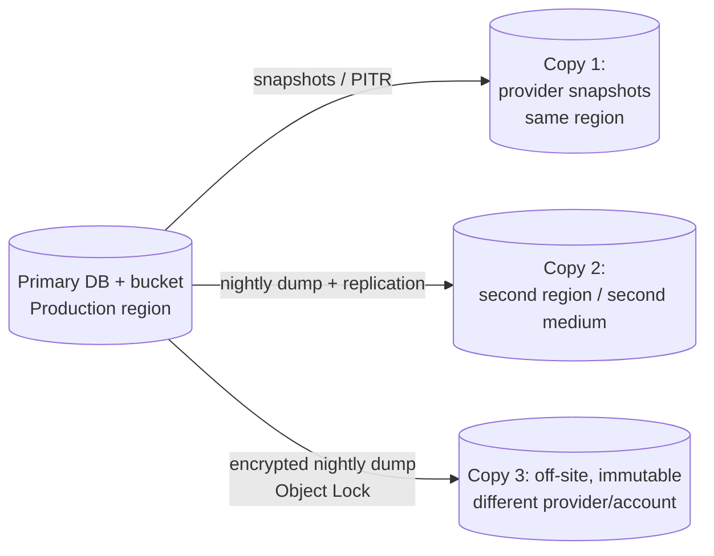

# ReserveChain.io — Backup, Restore and Disaster Recovery

> **Status:** Proposed — subject to final approval. RPO/RTO values below are *proposed targets* for ReserveChain to confirm; they are not commitments of any hosting provider.

> **Mandatory disclosure.** ReserveChain is currently in development. No tokens are being offered or sold through this website. Registration of interest does not constitute an investment, token purchase, asset reservation, price reservation, token allocation or entitlement to participate in any future offering. Any future availability will be subject to the final Swiss corporate and legal structure, definitive offering documentation, asset verification, custody arrangements, jurisdictional eligibility, KYC/KYB, sanctions screening and final approval.

---

## 1. What is backed up

| Data | Location | Criticality | Method |
|---|---|---|---|
| MySQL database (WP + `rc_*` tables incl. audit log) | RDS / managed MySQL | Critical | Automated snapshots + PITR (binlogs) + nightly logical dump (`mysqldump --single-transaction --routines --triggers`) |
| Documents / evidence files | Object storage | Critical | Versioning + Object Lock (compliance mode) + cross-region / cross-provider replication |
| `wp-content` code | Git (ReserveChain org) + container registry | High | Immutable tagged images; repo mirrors |
| Configuration / IaC | Git | High | Repo + mirror |
| Secrets | Secrets manager | Critical | Provider-native replication; break-glass export sealed offline (procedure owned by ReserveChain) |
| Audit-log exports | Object storage (WORM) | Critical | Daily JSONL export with hashes; anchored chain head on testnet |
| Smart-contract deployment records | `contracts/deployments/` in Git | High | Git |
| Mobile signing credentials | EAS / Apple / Google (ReserveChain accounts) | Critical | Provider-managed + offline sealed copy of keystore |

## 2. 3-2-1 strategy

- **3** copies of data (primary + 2 backups),
- on **2** different media/services (managed snapshots + object storage dumps),
- **1** off-site and immutable (separate account/provider with Object Lock; credentials not available to the production app).

All backups encrypted (KMS / age). Backup credentials are write-only from production.

## 3. Schedule and retention (proposed)

| Backup | Frequency | Retention |
|---|---|---|
| PITR (binlogs) | Continuous | 7–35 days |
| DB snapshot | Daily | 35 days |
| Logical dump (off-site) | Daily | 90 days daily, 12 monthly, 7 yearly (subject to counsel's retention policy) |
| Object storage versions | On write | 365 days non-current versions |
| Audit-log JSONL export | Daily | Indefinite (WORM) |

## 4. Targets (proposed)

| Metric | Target |
|---|---|
| RPO (data loss) | ≤ 15 minutes (PITR) |
| RTO (service restore, same region) | ≤ 4 hours |
| RTO (region loss) | ≤ 24 hours |

## 5. Monitoring

Backup job success/failure alerts; daily check that latest dump exists, is non-empty and decrypts; weekly automated restore of the latest dump into an ephemeral instance with `Audit_Log::verify()` run against it.

## 6. Restore procedures

### 6.1 Database point-in-time restore

1. Declare incident; switch Production to `maintenance` (ReserveChain → Settings → Site mode, or `wp option patch update rc_settings site_mode maintenance`).
2. Identify target time (before corruption) from audit log / alerts.
3. Restore RDS to new instance at target time (`aws rds restore-db-instance-to-point-in-time ...`).
4. Verify: row counts; `wp rc audit-verify` (chain integrity) on the restored DB; triggers present (`SELECT * FROM information_schema.TRIGGERS ...`).
5. Compare audit chain head with latest on-chain anchor (`AuditAnchor` events) — entries after the anchor are checked against the daily JSONL export.
6. Point application secrets at the new instance; redeploy current release.
7. Smoke test (TEST-PLAN §13); return to previous site mode; record in incident log.

> **Note on triggers:** a logical restore must include `--triggers`. After restore, load any page (plugin boot re-runs migrations when needed) or re-activate the plugin, which re-creates triggers idempotently; then confirm option `rc_audit_triggers = active` and run `wp rc tamper-test` on Staging to prove UPDATE/DELETE are rejected.

### 6.2 Document restore

Restore object versions from versioned bucket or replica; recompute SHA-256 and confirm it matches `_rc_sha256` for each `rc_document`; any mismatch is a SEV-2.

### 6.3 Full environment rebuild (region / provider loss)

1. Provision infrastructure from IaC in the DR region/provider.
2. Restore DB from off-site dump; restore documents from replica.
3. Restore secrets from replicated secrets manager (or break-glass procedure).
4. Deploy last known-good image tag.
5. Update DNS (low TTL pre-configured, 300 s).
6. Run verification and smoke tests; announce recovery.

## 7. DR drills

| Drill | Frequency | Evidence |
|---|---|---|
| Automated dump restore + integrity verify | Weekly | CI job log |
| Manual PITR restore to Staging | Quarterly | Drill report |
| Full rebuild in DR region | Annually and before launch (M9) | Drill report, timings vs RTO |

## 8. Blockchain considerations

On-chain state (testnet) is not "backed up" — it is replicated by the network. What must be preserved: deployment records (addresses, ABIs, tx hashes, config), role assignments and the multisig configuration. The audit anchor provides an external integrity reference for the off-chain audit log.
