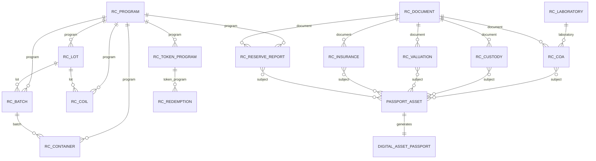
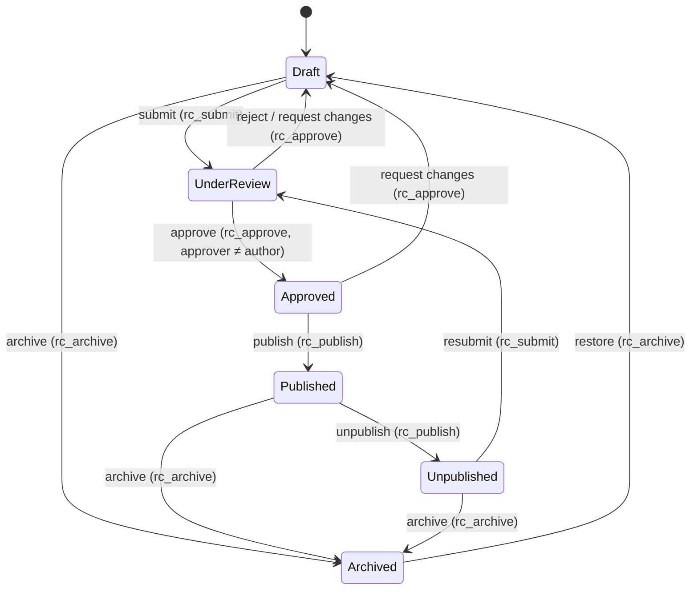

# ReserveChain.io — CMS Structure

> **Status:** Implemented in the demo plugin `reservechain-core` (v0.9.0, DB schema v3) and proposed for production — subject to final approval.
> **Authoritative source:** the registry is *declarative* — one definition in `wordpress/plugins/reservechain-core/includes/class-schema.php` drives post-type registration, admin meta boxes, validation, REST output, Digital Asset Passport rendering and completeness scoring. Tables below mirror that file. New entities or fields can be added through the `rc_registry_schema` filter without a platform rebuild. If this document and the schema file disagree, the schema file wins and this document must be updated in the same pull request.

> **Mandatory disclosure.** ReserveChain is currently in development. No tokens are being offered or sold through this website. Registration of interest does not constitute an investment, token purchase, asset reservation, price reservation, token allocation or entitlement to participate in any future offering. Any future availability will be subject to the final Swiss corporate and legal structure, definitive offering documentation, asset verification, custody arrangements, jurisdictional eligibility, KYC/KYB, sanctions screening and final approval.
>
> **EU/EEA notice.** ReserveChain does not currently intend to offer tokens to residents of, or persons located in, the EU/EEA.

---

## 1. Conventions

- **No invented data.** Every factual field is optional unless marked required, and every public field defines a `pending` text that is rendered when no value exists (e.g. *"Pending — Certificate of Analysis required"*, *"Custodian to be appointed — subject to final approval"*). Seed/demo content never contains prices, supply, purity figures or counterparties.
- **Claim / verification status.** Every registry entity carries `verification_status` (type `status`), one of `proposed` · `in_development` · `pending_verification` · `verified` · `not_applicable`; default `in_development`. Rendered as colour-coded pills (proposed = nickel, in_development = amber, pending_verification = copper, verified = green, not_applicable = muted).
- **Visibility.** `public: true` fields may appear on the website, in the REST API and on passports once the record is Published. `public: false` fields are admin-only and never serialised publicly.
- **Storage.** Each registry entity is a WordPress custom post type (`rc_*`); field values are stored as post meta with key `_rc_<field_key>`. Operational data (audit log, anchors, waitlist, support, notifications) live in dedicated `wp_rc_*` tables.
- **Registry numbers.** Each entity has a prefix used to generate a human-readable registry number (`PRG`, `LAB`, `LOT`, `BAT`, `CTN`, `COL`, `COA`, `CUS`, `VAL`, `INS`, `RSV`, `TKN`, `RDM`, `DOC`). Demo identifiers are illustrative and do not refer to real assets.
- **Workflow.** Every registry post carries a workflow state (§5). Only Published records appear publicly.
- **Audit.** Every create, update, transition, deletion attempt, login, role change, option change, plugin/theme change and media upload is appended to `wp_rc_audit_log`.

Field type legend: `text` · `textarea` · `number` (with unit) · `date` · `select` · `relation` (one) · `relations` (many) · `country` (ISO 3166-1 alpha-2) · `url` · `money` · `status` · `file`.

---

## 2. Admin menu tree

```
WordPress Admin
└── ReserveChain                                 (dashboard: review queue, pending claims, chain integrity, site mode)
    ├── Programs
    │   └── Metal Programs                       rc_program
    ├── Physical assets
    │   ├── Lots                                 rc_lot
    │   ├── Batches                              rc_batch
    │   ├── Containers                           rc_container
    │   └── Coils / Spools                       rc_coil
    ├── Evidence
    │   ├── Laboratories                         rc_laboratory
    │   ├── Certificates of Analysis             rc_coa
    │   ├── Custody & Ownership                  rc_custody
    │   ├── Valuations                           rc_valuation
    │   ├── Insurance                            rc_insurance
    │   └── Documents                            rc_document
    ├── Proof of Reserves
    │   └── Reserve Reports                      rc_reserve_report
    ├── Tokenization
    │   ├── Token Programs                       rc_token_program
    │   └── Redemptions                          rc_redemption   (internal only; module flag "redemption")
    ├── Digital Asset Passports                  (generated for lots, batches, containers, coils)
    ├── Workflow / Review Queue
    ├── Waitlist                                 wp_rc_waitlist  (view / export — rc_manage_waitlist)
    ├── Compliance                               jurisdictions, KYC/KYB/AML/sanctions statuses, disclosures
    ├── Audit Trail                              view, filter, export, Verify chain integrity, Anchor chain head
    ├── Settings                                 site mode, module visibility, languages, network, integrations
    └── Help                                     links to manuals in docs/
```

Sub-menu grouping follows the `group` attribute in the schema (`Programs`, `Physical assets`, `Evidence`, `Proof of Reserves`, `Tokenization`).

---

## 3. Registry entities and fields

Columns: **Field** (meta key without `_rc_` prefix) · **Type** · **Req.** · **Public** · **Pending text / notes**.

### 3.1 Metal Program — `rc_program` (prefix `PRG`)

| Field | Type | Req. | Public | Pending text / notes |
|---|---|---|---|---|
| `symbol` | text | Y | Y | Element symbol, e.g. `Cu`, `Ni` |
| `atomic_number` | number | N | Y | 29 / 28 — a physical constant used for the element tile, not an asset claim |
| `material_form` | text | N | Y | "Pending — material form to be confirmed" |
| `purity_grade_target` | text | N | Y | "Pending — to be confirmed by laboratory analysis" |
| `specification_standard` | text | N | Y | "Pending — standard to be confirmed" |
| `unit_of_account` | select (kg, t, lb) | N | Y | "Not yet determined" |
| `origin_disclosure` | textarea | N | Y | "Pending — sourcing disclosure to be provided" |
| `industrial_uses` | textarea | N | Y | Generic industrial context only |
| `program_manager_notes` | textarea | N | **N** | Internal notes |
| `verification_status` | status | Y | Y | default `in_development` |

### 3.2 Laboratory — `rc_laboratory` (prefix `LAB`)

| Field | Type | Req. | Public | Pending text / notes |
|---|---|---|---|---|
| `legal_name` | text | N | Y | "Laboratory to be appointed" — **no laboratory is named in the demo** |
| `country` | country | N | Y | "Not yet provided" |
| `accreditation` | text | N | Y | e.g. ISO/IEC 17025 — "Pending — accreditation evidence required" |
| `accreditation_number` | text | N | Y | "Not yet provided" |
| `accreditation_expiry` | date | N | Y | |
| `website` | url | N | Y | |
| `contact_internal` | textarea | N | **N** | |
| `verification_status` | status | Y | Y | |

### 3.3 Lot — `rc_lot` (prefix `LOT`) — passport-bearing

| Field | Type | Req. | Public | Pending text / notes |
|---|---|---|---|---|
| `program` | relation → rc_program | Y | Y | |
| `lot_reference` | text | N | Y | Producer lot reference — "Not yet provided" |
| `producer` | text | N | Y | "Pending — producer to be disclosed" |
| `production_date` | date | N | Y | |
| `gross_weight` | number (kg) | N | Y | "Pending — weight certificate required" |
| `net_weight` | number (kg) | N | Y | "Pending — weight certificate required" |
| `declared_purity` | text | N | Y | "Pending — Certificate of Analysis required" |
| `country_of_origin` | country | N | Y | "Not yet provided" |
| `chain_of_custody_notes` | textarea | N | Y | |
| `verification_status` | status | Y | Y | |

### 3.4 Batch — `rc_batch` (prefix `BAT`) — passport-bearing

| Field | Type | Req. | Public | Pending text / notes |
|---|---|---|---|---|
| `program` | relation → rc_program | Y | Y | |
| `lot` | relation → rc_lot | N | Y | Parent lot |
| `batch_reference` | text | N | Y | "Not yet provided" |
| `net_weight` | number (kg) | N | Y | "Pending — weight certificate required" |
| `particle_size` | text | N | Y | Powder only — "Pending — laboratory analysis required" |
| `packaging` | text | N | Y | "Not yet provided" |
| `verification_status` | status | Y | Y | |

### 3.5 Container — `rc_container` (prefix `CTN`) — passport-bearing

| Field | Type | Req. | Public | Pending text / notes |
|---|---|---|---|---|
| `program` | relation → rc_program | Y | Y | |
| `batch` | relation → rc_batch | N | Y | |
| `container_id` | text | N | Y | Container / drum ID — "Not yet provided" |
| `seal_number` | text | N | Y | "Pending — sealed at custody intake" |
| `net_weight` | number (kg) | N | Y | "Pending — weight certificate required" |
| `location_disclosure` | text | N | Y | Disclosure-level location only — "Pending — custody arrangement not yet confirmed" |
| `verification_status` | status | Y | Y | |

### 3.6 Coil / Spool — `rc_coil` (prefix `COL`) — passport-bearing

| Field | Type | Req. | Public | Pending text / notes |
|---|---|---|---|---|
| `program` | relation → rc_program | Y | Y | |
| `lot` | relation → rc_lot | N | Y | |
| `coil_id` | text | N | Y | "Not yet provided" |
| `wire_diameter` | text | N | Y | "Pending — laboratory analysis required" |
| `length` | number (m) | N | Y | "Not yet provided" |
| `net_weight` | number (kg) | N | Y | "Pending — weight certificate required" |
| `seal_number` | text | N | Y | "Pending — sealed at custody intake" |
| `verification_status` | status | Y | Y | |

### 3.7 Certificate of Analysis — `rc_coa` (prefix `COA`, evidence kind `coa`)

| Field | Type | Req. | Public | Pending text / notes |
|---|---|---|---|---|
| `subject` | relations → lot/batch/container/coil | Y | Y | Assets the certificate applies to |
| `laboratory` | relation → rc_laboratory | N | Y | |
| `certificate_number` | text | N | Y | "Not yet provided" |
| `issue_date` | date | N | Y | |
| `method` | text | N | Y | Analytical method — "Not yet provided" |
| `result_purity` | text | N | Y | "Pending — certificate not yet issued" |
| `document` | relation → rc_document | N | Y | PDF with SHA-256 fingerprint |
| `verification_status` | status | Y | Y | |

### 3.8 Custody & Ownership — `rc_custody` (prefix `CUS`, evidence kind `custody`)

| Field | Type | Req. | Public | Pending text / notes |
|---|---|---|---|---|
| `subject` | relations → lot/batch/container/coil | Y | Y | |
| `record_type` | select (custody_intake, custody_transfer, ownership, release) | N | Y | |
| `custodian` | text | N | Y | "Custodian to be appointed — subject to final approval" |
| `legal_owner` | text | N | Y | "Pending — subject to final legal structure" |
| `jurisdiction` | country | N | Y | "Not yet determined" |
| `effective_date` | date | N | Y | |
| `warehouse_receipt_no` | text | N | Y | "Not yet issued" |
| `document` | relation → rc_document | N | Y | |
| `verification_status` | status | Y | Y | |

### 3.9 Valuation — `rc_valuation` (prefix `VAL`, evidence kind `valuation`)

| Field | Type | Req. | Public | Pending text / notes |
|---|---|---|---|---|
| `subject` | relations → lot/batch/container/coil/program | Y | Y | |
| `valuer` | text | N | Y | "Valuer to be appointed" |
| `valuation_date` | date | N | Y | |
| `methodology` | textarea | N | Y | "Not yet provided" |
| `value` | money | N | Y | "No valuation published — subject to independent valuation". Publication of any value requires compliance approval (four-eyes) |
| `currency` | select (CHF, USD, EUR) | N | Y | |
| `document` | relation → rc_document | N | Y | Valuation report |
| `verification_status` | status | Y | Y | |

### 3.10 Insurance — `rc_insurance` (prefix `INS`, evidence kind `insurance`)

| Field | Type | Req. | Public | Pending text / notes |
|---|---|---|---|---|
| `subject` | relations → lot/batch/container/coil/program | Y | Y | |
| `insurer` | text | N | Y | "Insurance not yet arranged — subject to final approval" |
| `policy_number` | text | N | **N** | |
| `coverage_type` | text | N | Y | "Not yet determined" |
| `coverage_amount` | money | N | Y | "Not yet determined" |
| `period_start` / `period_end` | date | N | Y | |
| `document` | relation → rc_document | N | Y | Certificate of insurance |
| `verification_status` | status | Y | Y | |

### 3.11 Reserve Report — `rc_reserve_report` (prefix `RSV`, evidence kind `reserve`)

| Field | Type | Req. | Public | Pending text / notes |
|---|---|---|---|---|
| `program` | relation → rc_program | Y | Y | |
| `subject` | relations → lot/batch/container/coil | N | Y | Assets covered |
| `report_date` | date | N | Y | |
| `attestor` | text | N | Y | "Independent attestor to be appointed" |
| `reserve_units` | number | N | Y | "No attestation published" |
| `tokens_outstanding` | number | N | Y | "Not applicable — no tokens issued" |
| `onchain_tx` | text | N | Y | `ReserveGuard` attestation tx (testnet) |
| `document` | relation → rc_document | N | Y | |
| `verification_status` | status | Y | Y | |

### 3.12 Token Program — `rc_token_program` (prefix `TKN`)

All economic parameters are unset by default and display *"Not yet determined — subject to written approval"*. They are never hard-coded in the website, app or contracts.

| Field | Type | Req. | Public | Pending text / notes |
|---|---|---|---|---|
| `program` | relation → rc_program | Y | Y | |
| `token_name` | text | N | Y | "Not yet determined — subject to written approval" |
| `token_symbol` | text | N | Y | idem |
| `network` | select (sepolia, amoy, ethereum*) | N | Y | "Testnet only — no mainnet deployment". *`ethereum` is listed only so the option is visibly gated: it requires written authorization and is not used in this engagement |
| `contract_address` | text | N | Y | "Not deployed" |
| `max_supply` | number | N | Y | "Not yet determined — subject to written approval" |
| `asset_to_token_ratio` | text | N | Y | idem — unset ⇒ reserve-gated minting disabled |
| `holder_rights` | textarea | N | Y | "Not yet determined — subject to final legal structure" |
| `redemption_min` | number | N | Y | "Not yet determined — subject to written approval" |
| `allocations` | textarea | N | Y | idem |
| `approval_reference` | text | N | **N** | Written approval reference — required before any tokenomics parameter is published |
| `verification_status` | status | Y | Y | |

### 3.13 Redemption — `rc_redemption` (prefix `RDM`) — entity is internal (`public: false`)

| Field | Type | Req. | Public | Notes |
|---|---|---|---|---|
| `token_program` | relation → rc_token_program | N | N | |
| `requester` | text | N | N | Internal reference (no PII in title) |
| `amount` | number | N | N | Token amount |
| `redemption_state` | select (requested, compliance_review, approved, tokens_burned, fulfilled, rejected, cancelled) | N | N | Mirrors `RedemptionManager` lifecycle |
| `onchain_request_id` | text | N | N | |
| `burn_tx` | text | N | N | |
| `fulfilment_ref` | text | N | N | Physical delivery reference — process subject to final approval |

### 3.14 Document — `rc_document` (prefix `DOC`)

| Field | Type | Req. | Public | Pending text / notes |
|---|---|---|---|---|
| `file` | file | Y | Y | SHA-256 computed automatically on save (`_rc_sha256`); becomes immutable once published |
| `doc_type` | select (whitepaper, coa, weight, custody, insurance, valuation, reserve, legal, policy, specimen, other) | N | Y | |
| `issued_by` | text | N | Y | "Not yet provided" |
| `issue_date` | date | N | Y | |
| `version_label` | text | N | Y | |
| `subject` | relations → lot/batch/container/coil/program/token_program | N | Y | |
| `public_library` | select (no, yes) | N | **N** | Controls listing in public Documents library |
| `verification_status` | status | Y | Y | |

### 3.15 Digital Asset Passport (derived)

Passports are **generated**, not separately authored, for every Published record of a passport-bearing type (`rc_lot`, `rc_batch`, `rc_container`, `rc_coil`). The REST shape (`GET /passports/{passport_no}`) is:

| Element | Source |
|---|---|
| `passport_no`, `entity_type`, `program`, `title`, `status` | Entity record |
| `fields[] {key,label,value|null,status}` | All public schema fields; `null` values carry the field's pending text |
| `timeline[] {date,event,status}` | Derived from linked evidence (CoA issue dates, custody effective dates, reserve report dates) and workflow events |
| `documents[] {id,title,type,sha256,status,issued_by|null}` | Linked `rc_document` records via evidence entities |
| `custody[]` | Linked `rc_custody` records |
| `merkle_root` | Merkle root over the sorted SHA-256 fingerprints of linked evidence documents |
| `qr_url` | QR code resolving to the public passport URL |
| completeness score | Share of public fields with provided (non-pending) values — shown so gaps are visible |

### 3.16 Operational tables

**`wp_rc_audit_log`** (append-only; UPDATE/DELETE rejected by triggers `wp_rc_audit_no_update` / `wp_rc_audit_no_delete`)

| Column | Type | Notes |
|---|---|---|
| `id` | BIGINT UNSIGNED AI | Sequence number (`seq`) |
| `created_at` | DATETIME(6) | |
| `actor_id`, `actor_login`, `actor_role` | BIGINT / VARCHAR | 0 = system |
| `ip_hash` | CHAR(64) | HMAC-SHA-256 of IP with site salt (no raw IPs) |
| `action` | VARCHAR(64) | e.g. `plugin.activated`, `system.migrated`, `auth.login_failed`, `media.uploaded` |
| `object_type`, `object_id` | VARCHAR / BIGINT | |
| `summary` | VARCHAR(512) | Human-readable |
| `data` | LONGTEXT (JSON) | Context; no secrets |
| `prev_hash` | CHAR(64) | Genesis = 64 × `0` |
| `row_hash` | CHAR(64) UNIQUE | See verification contract below |

**Row-hash verification contract** (implemented in `Audit_Log::hash_row`):

```
row_hash = SHA-256( join( 0x1F,
    prev_hash, created_at, actor_id, actor_login, actor_role, ip_hash,
    action, object_type, object_id, summary, data ) )
```

Field order and the unit-separator byte (`0x1F`) are part of the contract; any external verifier must use exactly this ordering. Writes are serialised with a MySQL named lock (`GET_LOCK('rc_audit_chain')`) so concurrent requests cannot fork the chain.

**`wp_rc_audit_anchor`** — `id, created_at, seq, chain_head, network, tx_hash, anchored_by`. Records each on-chain anchoring of the chain head; the stored head is checked against the log row at `seq` before acceptance.

**`wp_rc_waitlist`**

| Column | Notes |
|---|---|
| `name`, `email`, `email_hash` (unique) | PII — restricted to `rc_manage_waitlist` |
| `country` (ISO-2), `entity_type` (individual / institution), `organisation` | |
| `interest` (cu, ni), `language` (en, es, it) | |
| `jurisdiction_status` | `pending` / `eligible` / `restricted` (EU/EEA ⇒ `restricted`) |
| `status` | `pending_confirmation` → confirmed, etc. |
| `general_updates_only` | EU/EEA registrants who opt in to general updates only |
| `confirm_token_hash`, `confirmed_at` | Double opt-in (token stored only as hash) |
| `consent_version`, `consent_hash` | Version + SHA-256 of the consent text shown |
| `source` (web / app), `ip_hash`, `created_at`, `updated_at` | |

**`wp_rc_support`** — `user_id, channel, name, email, subject, message, status`.
**`wp_rc_notifications`** — `user_id, title, body, category, read_at`.

Member eligibility (KYC / KYB / AML / sanctions / jurisdiction) is stored per user (user meta) with values `not_started` / `pending` / `approved` / `rejected` and jurisdiction `eligible` / `restricted` / `pending`, exposed via `GET /me`. Provider integration is **planned**; provider **[To be decided by ReserveChain]**.

---

## 4. Relationships (ER diagram)



`PASSPORT_ASSET` denotes any of `rc_lot`, `rc_batch`, `rc_container`, `rc_coil`.

---

## 5. Workflow state machine (four-eyes)



WordPress post statuses: `draft` → `rc_review` → `rc_approved` → `publish` → `rc_unpublished` → `rc_archived` (implemented in `includes/class-workflow.php`; applies to registry entities and to pages/posts).

Server-side guards:

1. The approving user must differ from the author (and from the last editor) — enforced in `Workflow`, not just hidden in the UI.
2. Editors and registry managers never hold `publish_rc_entities`; publishing happens only via the workflow (`rc_publish`).
3. Direct publishing is intercepted: a save that attempts `publish` without `rc_publish` is routed to Under Review; edits to Published content by users without `rc_publish` move the item to Under Review.
4. Every transition is written to the audit trail via `transition_post_status`.
5. Activating gated modules or tokenomics parameters requires a written approval reference (`rc_authorize_modules`, `approval_reference`).

---

## 6. Role / capability matrix

Custom capabilities (from `Install::CAPS`):

| Capability | Meaning |
|---|---|
| `rc_manage_registry` | Create and edit Asset Registry records |
| `rc_submit` | Submit content for review |
| `rc_approve` | Approve or reject content under review (four-eyes) |
| `rc_publish` | Publish / unpublish approved content |
| `rc_archive` | Archive content |
| `rc_manage_compliance` | Manage KYC/KYB/AML/sanctions and jurisdiction controls |
| `rc_manage_waitlist` | View and export the waitlist |
| `rc_view_audit` | View and verify the audit trail |
| `rc_anchor_audit` | Anchor the audit chain head on-chain |
| `rc_manage_settings` | Change site mode, modules and platform settings |
| `rc_authorize_modules` | Activate gated modules (wallet, purchase, PoR, redemption) with a written authorization reference |

Matrix (✔ = granted, — = not granted):

| Capability | administrator | rc_compliance_officer | rc_reviewer | rc_registry_manager | rc_editor | rc_auditor |
|---|---|---|---|---|---|---|
| Edit pages / posts (content) | ✔ | ✔ | ✔ | ✔ | ✔ | — |
| Upload files | ✔ | ✔ | ✔ | ✔ | ✔ | — |
| Edit registry entities (`edit_rc_entities` …) | ✔ | ✔ | ✔ | ✔ | — | read-only¹ |
| `publish_rc_entities` (direct publish) | ✔ | — | — | — | — | — |
| `rc_manage_registry` | ✔ | — | — | ✔ | — | — |
| `rc_submit` | ✔ | — | — | ✔ | ✔ | — |
| `rc_approve` (not own work) | ✔ | ✔ | ✔ | — | — | — |
| `rc_publish` | ✔ | ✔ | — | — | — | — |
| `rc_archive` | ✔ | ✔ | — | — | — | — |
| `rc_manage_compliance` | ✔ | ✔ | — | — | — | — |
| `rc_manage_waitlist` | ✔ | ✔ | — | — | — | — |
| `rc_view_audit` | ✔ | ✔ | ✔ | — | — | ✔ |
| `rc_anchor_audit` | ✔ | — | — | — | — | — |
| `rc_manage_settings` | ✔ | — | — | — | — | — |
| `rc_authorize_modules` | ✔ | — | — | — | — | — |
| List / edit users | ✔ | ✔ | — | — | — | — |
| Modify audit log rows | ✖ blocked by DB triggers for every role | | | | | |

¹ `rc_auditor` receives `read_private_rc_entities` and `edit_rc_entities` solely so WordPress lists Draft items in admin; save actions are denied by the workflow layer.

Recommended production policy (subject to approval): administrators are named ReserveChain individuals; the person who holds `administrator` should not also act as compliance approver for the same change; MFA mandatory for all of the above roles.

---

## 7. Site modes and module flags

### 7.1 Site modes (`rc_manage_settings`; stored in option `rc_settings`)

| Mode | Behaviour | Default |
|---|---|---|
| `prelaunch` | Full informational site, waitlist open, no offering | ✔ |
| `waitlist_only` | Homepage, disclosures, waitlist and contact only | |
| `maintenance` | Holding page for visitors; staff unaffected; `/config` reports `maintenance` | |
| `live` | **Locked.** Refused by the settings guard unless the constant `RC_ALLOW_LIVE_MODE` is defined server-side *and* written authorization exists. Not used in this engagement | |

### 7.2 Module visibility (exposed via `GET /config` → `modules`)

| Module | Kind | Default | Gate |
|---|---|---|---|
| `waitlist` | open | on | `rc_manage_settings` |
| `registry_public` | open | on | `rc_manage_settings` |
| `passports_public` | open | on | `rc_manage_settings` |
| `verify_tool` | open | on | `rc_manage_settings` |
| `app_registration` | open | on | `rc_manage_settings` |
| `wallet` | **gated** | **off** | `rc_authorize_modules` + written authorization reference |
| `purchase` | **gated** | **off** | idem |
| `proof_of_reserves` | **gated** | **off** | idem |
| `redemption` | **gated** | **off** | idem |

The settings guard (`pre_update_option_rc_settings`) silently reverts any attempt to enable a gated module without the capability and reference, and shows an admin error. In addition, each public website section (Overview, Copper Powder, Nickel Wire, Asset Registry, Digital Asset Passports, Verification, Custody, Proof of Reserves, Tokenization, Redemption, Enterprise Services, Documents & Whitepaper, Roadmap, Governance, FAQ, …) can be shown or hidden individually.

When a gated module is off, its pages show an explicit *"Inactive — subject to final approval"* state, its API endpoints return `{enabled:false, items:[]}`, and the mobile app shows a locked state. Every change is audit-logged (option change hook) with old and new values.

---

## 8. Compliance controls

| Control | Implementation |
|---|---|
| Mandatory disclosure | Rendered site-wide (banner + footer), in the app, in documents and returned by `GET /config` |
| EU/EEA notice | Rendered site-wide and on the waitlist; EU/EEA country list in `Schema::eu_eea_countries()` (AT BE BG HR CY CZ DK EE FI FR DE GR HU IE IT LV LT LU MT NL PL PT RO SK SI ES SE IS LI NO) |
| Waitlist jurisdiction logic | EU/EEA ⇒ `jurisdiction_status = restricted`; notice displayed; general updates only with opt-in |
| Jurisdiction controls | Restricted / blocked jurisdiction lists managed by `rc_manage_compliance`; on-chain mirror via `ComplianceRegistry` blocked-jurisdiction list (no PII) |
| KYC / KYB / AML / sanctions | Status model per member; provider integration planned; only `rc_manage_compliance` may change statuses |
| Claim status | Required on all registry entities; rendered publicly |
| No invented data | Pending texts in schema; seeded demo data contain no figures for our assets |
| Consent capture | Consent version + SHA-256 per waitlist record; double opt-in |
| Privacy | Emails hashed for uniqueness; IPs stored only as HMAC; PII restricted to compliance roles |
| Segregation of duties | Four-eyes workflow; editors cannot publish; gated modules require authorization reference |
| Tamper evidence | Hash-chained audit trail + DB triggers + optional on-chain anchoring |
