# ReserveChain.io — Deployment, Rollback and Maintenance Runbook

> **Status:** Proposed procedures — subject to final approval. Commands assume Option A (AWS) from [`ARCHITECTURE.md §6`](ARCHITECTURE.md#6-infrastructure-proposal); equivalents for Hetzner/managed hosting are noted. WP-CLI commands under `wp rc …` are provided by the `reservechain-core` plugin (`includes/class-cli.php`): `seed`, `audit-verify`, `audit-head`, `tamper-test`, `import-doc`, `passport` — run `wp help rc` for the authoritative list in the deployed version. Platform settings (site mode, modules) are stored in the `rc_settings` option and are guarded: gated modules cannot be enabled without a written authorization reference, and `live` mode is refused unless `RC_ALLOW_LIVE_MODE` is defined.

> **Mandatory disclosure.** ReserveChain is currently in development. No tokens are being offered or sold through this website. Registration of interest does not constitute an investment, token purchase, asset reservation, price reservation, token allocation or entitlement to participate in any future offering. Any future availability will be subject to the final Swiss corporate and legal structure, definitive offering documentation, asset verification, custody arrangements, jurisdictional eligibility, KYC/KYB, sanctions screening and final approval.

---

## 1. Local development (contest demo)

```bash
# prerequisites: Docker Desktop, Node 20+, Git
git clone <reservechain-repo> && cd reservechain.io
cp contracts/.env.example contracts/.env; cp mobile/.env.example mobile/.env   # local-only values; never commit .env
docker compose up -d              # WordPress, MySQL 8, phpMyAdmin
# open http://localhost:8080 → complete WP install → activate theme "reservechain" and plugin "ReserveChain Core"

# contracts
cd contracts && npm ci && npx hardhat test

# mobile
cd ../mobile && npm ci && npx expo start   # set API base URL in app config to your local WP
```

## 2. Environment variables (template)

Every environment provides these via the secrets manager (Production/Staging) or `.env` (Dev). Names are indicative; the `.env.example` files in each package are authoritative.

| Variable | Used by | Notes |
|---|---|---|
| `WORDPRESS_DB_HOST`, `WORDPRESS_DB_NAME`, `WORDPRESS_DB_USER`, `WORDPRESS_DB_PASSWORD` | WP | Per environment |
| `WP_AUTH_KEY` … `WP_NONCE_SALT` (8 salts) | WP | Unique per environment |
| `RC_ENV` | plugin | `development` / `staging` / `production` |
| `RC_API_HMAC_SECRET` | plugin | Bearer token signing; rotate with overlap |
| `RC_RPC_URL`, `RC_CHAIN_ID` | plugin | Testnet RPC (Sepolia 11155111 / Amoy 80002) |
| `RC_ANCHOR_PRIVATE_KEY` | plugin anchor job | `ANCHOR_ROLE` only; secrets manager only |
| `RC_SMTP_*` | plugin | Email provider [To be decided] |
| `RC_S3_BUCKET`, `RC_S3_REGION` | plugin | Document storage |
| `SEPOLIA_RPC_URL`, `AMOY_RPC_URL`, `DEPLOYER_PRIVATE_KEY`, `ETHERSCAN_API_KEY` | contracts | Never in CI logs; hardware wallet preferred |
| `EXPO_PUBLIC_API_BASE_URL` | mobile | Public, non-secret |

## 3. Release and deployment (Staging → Production)

```mermaid
flowchart LR
    pr[Pull request] --> ci[CI: lint, PHPUnit, PHPStan,<br/>Hardhat tests, npm audit,<br/>image build + Trivy scan]
    ci --> merge[Merge to main]
    merge --> stg[Auto-deploy to Staging]
    stg --> smoke[Smoke + E2E tests]
    smoke --> uat[UAT / reviewer sign-off]
    uat --> tag[Tag vX.Y.Z]
    tag --> appr[Manual approval<br/>ReserveChain release owner]
    appr --> snap[Pre-deploy DB snapshot]
    snap --> prod[Rolling deploy to Production]
    prod --> verify[Post-deploy verification]
```



### 3.1 Pre-deployment checklist

- [ ] Release notes and change list approved by ReserveChain release owner.
- [ ] All CI checks green; no open critical/high vulnerabilities.
- [ ] Staging deployed with the identical image tag and UAT signed off.
- [ ] DB migration reviewed (forward-compatible with the previous release where possible: expand → migrate → contract).
- [ ] On-call engineer and rollback owner named.
- [ ] Maintenance window communicated if downtime is expected.

### 3.2 Deployment steps (Production)

1. Create a manual DB snapshot labelled `pre-vX.Y.Z` and note the time (PITR reference).
2. Trigger the `deploy-production` workflow with tag `vX.Y.Z` (requires approval in CI environment protection rules).
3. Pipeline updates the ECS service (or `docker compose pull && up -d` per VM for Hetzner) — rolling, min-healthy 100 %.
4. Migrations run automatically and idempotently on the first request after deploy (plugin boot compares `rc_db_version` with `RC_DB_VERSION`; tables, triggers and roles are re-applied). The pipeline triggers this with a warm-up request and then runs `wp rc audit-verify`. The migration is recorded in the audit log (`system.migrated`).
5. Purge CDN cache for HTML (assets are content-hashed).

### 3.3 Post-deployment verification

- [ ] `GET /wp-json/rc/v1/config` returns expected `site_mode`, module flags (gated modules still `false`), disclosure text.
- [ ] Home, program pages, a passport page, Verify, Waitlist render; disclosure + EU/EEA notice visible.
- [ ] Admin → Audit Trail → Verify chain integrity: **OK**; triggers status **active**.
- [ ] Error rate and latency normal for 30 minutes.
- [ ] Record deployment in the release log.

## 4. Rollback

Decision rule: roll back if a SEV-1/SEV-2 regression is detected and a forward fix cannot be deployed within 30 minutes.

| Situation | Procedure | Target time |
|---|---|---|
| Code-only regression (no schema change) | Redeploy previous image tag `vX.Y.(Z-1)` via `deploy-production` | < 15 min |
| Release included backward-compatible migration | Redeploy previous tag; leave additive schema in place | < 15 min |
| Release included non-backward-compatible migration or data corruption | Maintenance mode → PITR restore to `pre-vX.Y.Z` time (BACKUP-DR §6.1) → deploy previous tag | < 4 h |
| Bad content published | Use workflow: Unpublish → revise; no DB rollback needed (audit trail retains history) | minutes |
| Contract issue (testnet) | Multisig `pause()`; deploy corrected contract; update addresses in token program record via workflow | per incident |

**Audit-log note:** a PITR restore discards audit entries written after the restore point. Before restoring, export the audit log (JSONL) and archive it with the incident record so the discarded entries remain evidenced; the post-restore chain is verified independently.

## 5. Maintenance

### 5.1 Routine

| Task | Frequency | Owner |
|---|---|---|
| Apply WordPress core / plugin / theme / dependency updates (via PR + CI) | Weekly window | Ops |
| Review WAF events, failed logins, integrity job | Daily (automated alerts) | Ops |
| Review module flags and site mode audit entries | Weekly | Compliance officer |
| Access review (roles, MFA enrolment) | Quarterly | Compliance officer |
| Restore drill | Quarterly | Ops |
| Certificate / domain expiry check | Monthly (automated) | Ops |
| Secrets rotation | Per SECURITY §8 | Ops |
| Audit anchor (if enabled) | Daily / on demand | System |

### 5.2 Planned maintenance window

1. Announce (banner) ≥ 48 h before if user-visible.
2. Switch site mode to `maintenance` (ReserveChain → Settings → Site mode, or `wp option patch update rc_settings site_mode maintenance`).
3. Perform work; verify on internal URL.
4. Restore previous mode; verify post-deploy checklist.

## 6. Smart-contract deployment (testnet only)

```bash
cd contracts
cp config/sepolia.example.json config/sepolia.json   # all tokenomics fields unset unless written approval exists
npx hardhat test
npx hardhat run scripts/deploy.ts --network sepolia
npx hardhat verify --network sepolia <address> <constructor args>
# then: grant DEFAULT_ADMIN to Safe, deployer renounces; run role-verification script
```

Record addresses and tx hashes in `contracts/deployments/sepolia.json` and in the CMS Token Program record (via workflow). **Mainnet deployment is not performed** under this engagement.

## 7. Troubleshooting

| Symptom | Likely cause | Action |
|---|---|---|
| Admin shows "audit triggers unavailable" | DB user lacks `TRIGGER` privilege / managed host restriction | Grant privilege temporarily, re-run migration, revoke; or escalate host choice (ARCHITECTURE §6 Option C) |
| Integrity check reports broken link | Tampering or manual DB edit | SEV-2: preserve evidence, compare with anchor + JSONL export, follow SECURITY §10 |
| Waitlist confirmation emails not arriving | SMTP creds / SPF / DKIM | Check provider logs, DNS records |
| `/verify` always `match:false` | Document not Published or hash computed on different file version | Confirm `_rc_sha256` and workflow state |
| App shows no modules | `/config` unreachable or CORS | Check API base URL, WAF rules |
| Hardhat tests fail after dependency update | OZ breaking change | Pin versions; review changelog |

Known issues are tracked in the repository issue tracker (label `known-issue`) and summarised at each milestone.
