# ReserveChain.io — Deployment, Rollback and Maintenance Runbook

> **Status:** Proposed procedures — subject to final approval. Commands assume Option A (AWS) from [`ARCHITECTURE.md §6`](ARCHITECTURE.md#6-infrastructure-proposal); equivalents for Hetzner/managed hosting are noted. WP-CLI commands under `wp rc …` are provided by the `reservechain-core` plugin (`includes/class-cli.php`): `seed`, `audit-verify`, `audit-head`, `tamper-test`, `import-doc`, `passport` — run `wp help rc` for the authoritative list in the deployed version. Platform settings (site mode, modules) are stored in the `rc_settings` option and are guarded: gated modules cannot be enabled without a written authorization reference, and `live` mode is refused unless `RC_ALLOW_LIVE_MODE` is defined.

> **Mandatory disclosure.** ReserveChain is currently in development. No tokens are being offered or sold through this website. Registration of interest does not constitute an investment, token purchase, asset reservation, price reservation, token allocation or entitlement to participate in any future offering. Any future availability will be subject to the final Swiss corporate and legal structure, definitive offering documentation, asset verification, custody arrangements, jurisdictional eligibility, KYC/KYB, sanctions screening and final approval.

---

## 1. Local development (contest demo)

```bash
# prerequisites: Docker Desktop, Node 20+, Git
git clone <reservechain-repo> && cd reservechain.io
cp contracts/.env.example contracts/.env; cp mobile/.env.example mobile/.env   # local-only values; never commit .env
docker compose up -d              # WordPress, MySQL 8, phpMyAdmin
# open http://localhost:8088 (or run: bash scripts/dev-reset.sh) → complete WP install → activate theme "reservechain" and plugin "ReserveChain Core"

# contracts
cd contracts && npm ci && npx hardhat test

# mobile
cd ../mobile && npm ci && npx expo start   # set API base URL in app config to your local WP
```

## 2. Environment variables (template)

Every environment provides these via the secrets manager (Production/Staging) or `.env` (Dev). Names are indicative; the `.env.example` files in each package are authoritative.

| Variable | Used by | Notes |
|---|---|---|
| `WORDPRESS_DB_HOST`, `WORDPRESS_DB_NAME`, `WORDPRESS_DB_USER`, `WORDPRESS_DB_PASSWORD` | WP | Per environment |
| `WP_AUTH_KEY` … `WP_NONCE_SALT` (8 salts) | WP | Unique per environment |
| `RC_ENV` | plugin | `development` / `staging` / `production` |
| `RC_API_HMAC_SECRET` | plugin | Bearer token signing; rotate with overlap |
| `RC_RPC_URL`, `RC_CHAIN_ID` | plugin | Testnet RPC (Sepolia 11155111 / Amoy 80002) |
| `RC_ANCHOR_PRIVATE_KEY` | plugin anchor job | `ANCHOR_ROLE` only; secrets manager only |
| `RC_SMTP_*` | plugin | Email provider [To be decided] |
| `RC_S3_BUCKET`, `RC_S3_REGION` | plugin | Document storage |
| `SEPOLIA_RPC_URL`, `AMOY_RPC_URL`, `DEPLOYER_PRIVATE_KEY`, `ETHERSCAN_API_KEY` | contracts | Never in CI logs; hardware wallet preferred |
| `EXPO_PUBLIC_API_BASE_URL` | mobile | Public, non-secret |

## 3. Release and deployment (Staging → Production)

```mermaid
flowchart LR
    pr[Pull request] --> ci[CI: lint, PHPUnit, PHPStan,<br/>Hardhat tests, npm audit,<br/>image build + Trivy scan]
    ci --> merge[Merge to main]
    merge --> stg[Auto-deploy to Staging]
    stg --> smoke[Smoke + E2E tests]
    smoke --> uat[UAT / reviewer sign-off]
    uat --> tag[Tag vX.Y.Z]
    tag --> appr[Manual approval<br/>ReserveChain release owner]
    appr --> snap[Pre-deploy DB snapshot]
    snap --> prod[Rolling deploy to Production]
    prod --> verify[Post-deploy verification]
```



### 3.1 Pre-deployment checklist

- [ ] Release notes and change list approved by ReserveChain release owner.
- [ ] All CI checks green; no open critical/high vulnerabilities.
- [ ] Staging deployed with the identical image tag and UAT signed off.
- [ ] DB migration reviewed (forward-compatible with the previous release where possible: expand → migrate → contract).
- [ ] On-call engineer and rollback owner named.
- [ ] Maintenance window communicated if downtime is expected.

### 3.2 Deployment steps (Production)

1. Create a manual DB snapshot labelled `pre-vX.Y.Z` and note the time (PITR reference).
2. Trigger the `deploy-production` workflow with tag `vX.Y.Z` (requires approval in CI environment protection rules).
3. Pipeline updates the ECS service (or `docker compose pull && up -d` per VM for Hetzner) — rolling, min-healthy 100 %.
4. Migrations run automatically and idempotently on the first request after deploy (plugin boot compares `rc_db_version` with `RC_DB_VERSION`; tables, triggers and roles are re-applied). The pipeline triggers this with a warm-up request and then runs `wp rc audit-verify`. The migration is recorded in the audit log (`system.migrated`).
5. Purge CDN cache for HTML (assets are content-hashed).

### 3.3 Post-deployment verification

- [ ] `GET /wp-json/rc/v1/config` returns expected `site_mode`, module flags (gated modules still `false`), disclosure text.
- [ ] Home, program pages, a passport page, Verify, Waitlist render; disclosure + EU/EEA notice visible.
- [ ] Admin → Audit Trail → Verify chain integrity: **OK**; triggers status **active**.
- [ ] Error rate and latency normal for 30 minutes.
- [ ] Record deployment in the release log.
- [ ] `GET /wp-json/rc/v1/health` returns `"status":"ok"` and the WordPress dashboard **Operations** widget is all green ([OPERATIONS.md](OPERATIONS.md)).

### 3.4 Single-server deployment (staging + production side by side) — exact commands

`deploy/deploy.sh` deploys either environment to one Linux host. Each environment is its own compose project
with its own volumes; one shared Caddy terminates HTTPS for both:

```
~/reservechain/edge/        docker-compose.edge.yml, Caddyfile, sites/<env>.caddy        project rc-edge
~/reservechain/production/  docker-compose.prod.yml, .env, app -> releases/<stamp>-<ref>  project rc-production
~/reservechain/staging/     (same layout)                                                 project rc-staging
   each also holds: backup.sh restore.sh rollback.sh ops-common.sh mu-plugins/rc-smtp.php logs/ releases.log
```

```bash
# from the workstation (repository root); SSH key default ~/.ssh/reservechain_deploy
SITE_HOST=staging.reservechain.io ADMIN_EMAIL=ops@reservechain.io deploy/deploy.sh --env staging ubuntu@SERVER_IP
deploy/deploy.sh --env production --ref v1.2.3 --host reservechain.io ubuntu@SERVER_IP
deploy/deploy.sh --env production --cron-only ubuntu@SERVER_IP     # (re)install crontab only
deploy/deploy.sh --env staging --push-env ubuntu@SERVER_IP         # upload edited deploy/env/staging.env
```

* **First deploy of an environment** generates `~/reservechain/<env>/.env` (mode 600) with random DB passwords,
  `RC_TOKEN_SECRET`, the 8 WordPress salts and `RC_HEALTH_TOKEN`, unless `deploy/env/<env>.env` exists locally
  (git-ignored; start from `deploy/env/<env>.env.example`). Missing keys are appended on later deploys; existing
  values are never overwritten. Without `--host`, hosts default to `<ip>.sslip.io` / `staging.<ip>.sslip.io`.
* **Releases:** `--ref <tag|commit>` builds the release with `git archive`; otherwise the working tree is shipped.
  Each release is unpacked to `releases/<UTC-stamp>-<ref>/`, the `app` symlink is swapped atomically and the
  WordPress container recreated; the 5 newest releases are kept for rollback (`releases.log` records history).
* **Install / upgrade:** first install runs `wp core install`, activates theme + plugin, seeds pages (full demo
  seed on staging, `--pages-only` on production unless `--seed-demo`); upgrades run `RC\Install::upgrade()` and
  `wp rc seed --pages-only`. Then `wp rc tamper-test` and `wp rc-ops check --no-alerts`.
* **Staging is never indexed:** Caddy adds `X-Robots-Tag: noindex, nofollow, noarchive`, serves a disallow-all
  `robots.txt`, and deploy.sh sets `blog_public=0`. Optional password protection: set
  `STAGING_BASIC_AUTH='reviewer:<bcrypt>'` in the staging `.env` (hash with
  `docker run --rm caddy:2 caddy hash-password --plaintext '…'`) and redeploy; `/wp-json/rc/v1/health*` stays
  reachable for uptime monitors. Note: basic auth also blocks the mobile app's API calls against staging.
* **Mail:** `WORDPRESS_SMTP_*` in `.env` are read by the mu-plugin `deploy/mu-plugins/rc-smtp.php` (mounted into
  `wp-content/mu-plugins`); empty `WORDPRESS_SMTP_HOST` = PHP `mail()`. Test: `wp rc-ops test-alert`.
* **Crontab** (installed per environment unless `--skip-cron`; times UTC converted to server time):
  backup 02:30 (production) / 03:00 (staging) via `backup.sh`; WP-cron every 5 minutes via
  `docker compose … run --rm -T wpcli wp cron event run --due-now` (`DISABLE_WP_CRON` is true in
  `docker-compose.prod.yml`); weekly truncation of logs over 20 MB. Inspect with `crontab -l | grep rc-ops`.
* **WP-CLI on the server:**
  `cd ~/reservechain/production && docker compose -p rc-production -f docker-compose.prod.yml --env-file .env run --rm wpcli wp <command>`.

**Migrating from the earlier single-stack layout** (`~/reservechain/docker-compose.prod.yml`, project
`reservechain`, Caddy inside the stack): deploy.sh stops with a "LEGACY" message. Migrate once:

```bash
# from the workstation: ship the backup tooling
ssh ubuntu@SERVER_IP 'mkdir -p ~/legacy' && scp deploy/backup.sh deploy/ops-common.sh ubuntu@SERVER_IP:legacy/
# on the server
cd ~/reservechain && cp docker-compose.prod.yml .env ~/legacy/
umask 077; tr -dc A-Za-z0-9 </dev/urandom | head -c 48 > ~/legacy/pass
RC_HOME=~/legacy COMPOSE_FILE=~/legacy/docker-compose.prod.yml COMPOSE_PROJECT=reservechain ENV_FILE=~/legacy/.env \
  BACKUP_DIR=~/legacy-backup BACKUP_PASSPHRASE_FILE=~/legacy/pass BACKUP_MARK=0 bash ~/legacy/backup.sh
sudo docker compose -p reservechain -f docker-compose.prod.yml --env-file .env down    # keeps the old volumes
mv ~/reservechain ~/reservechain.legacy
# from the workstation
deploy/deploy.sh --env production --host <same SITE_HOST as before> ubuntu@SERVER_IP
# on the server: restore the legacy data into the new production stack
cd ~/reservechain/production && BACKUP_PASSPHRASE_FILE=~/legacy/pass ./restore.sh \
  --archive ~/legacy-backup/daily/rc-*.tar.enc --restore-wp-config --i-know --no-pre-backup
```
(`--restore-wp-config` keeps the legacy salts so existing sessions, MFA and signed links keep working; delete
`~/legacy/pass` and the legacy volumes once verified.)

## 4. Rollback

Decision rule: roll back if a SEV-1/SEV-2 regression is detected and a forward fix cannot be deployed within 30 minutes.

| Situation | Procedure | Target time |
|---|---|---|
| Code-only regression (no schema change) | Redeploy previous image tag `vX.Y.(Z-1)` via `deploy-production` | < 15 min |
| Release included backward-compatible migration | Redeploy previous tag; leave additive schema in place | < 15 min |
| Release included non-backward-compatible migration or data corruption | Maintenance mode → PITR restore to `pre-vX.Y.Z` time (BACKUP-DR §6.1) → deploy previous tag | < 4 h |
| Bad content published | Use workflow: Unpublish → revise; no DB rollback needed (audit trail retains history) | minutes |
| Contract issue (testnet) | Multisig `pause()`; deploy corrected contract; update addresses in token program record via workflow | per incident |

**Audit-log note:** a PITR restore discards audit entries written after the restore point. Before restoring, export the audit log (JSONL) and archive it with the incident record so the discarded entries remain evidenced; the post-restore chain is verified independently.

### 4.1 Rollback on the single-server deployment — exact commands

```bash
cd ~/reservechain/production
./rollback.sh --list                          # kept releases, live one marked *
./rollback.sh --to previous                   # code only: swap the app symlink, recreate WordPress, re-run migrations
./rollback.sh --to v1.2.2                     # newest kept release built from that ref
./rollback.sh --to previous --with-db ~/reservechain-backups/production/daily/rc-production-20261006T023000Z.tar.age --i-know
                                              # code + database (BACKUP_AGE_IDENTITY / BACKUP_PASSPHRASE_FILE must be set)
# a ref no longer kept on the server: redeploy it from the workstation
deploy/deploy.sh --env production --ref v1.2.2 ubuntu@SERVER_IP
```

`rollback.sh` ends with `wp rc tamper-test`, `wp rc audit-verify` and `wp rc-ops health`. Before a database
rollback in production, follow the audit-log note above (export the audit log first); `restore.sh` additionally
takes an automatic safety backup of production unless `--no-pre-backup` is given.

## 5. Maintenance

### 5.1 Routine

| Task | Frequency | Owner |
|---|---|---|
| Apply WordPress core / plugin / theme / dependency updates (via PR + CI) | Weekly window | Ops |
| Review WAF events, failed logins, integrity job | Daily (automated alerts) | Ops |
| Review module flags and site mode audit entries | Weekly | Compliance officer |
| Access review (roles, MFA enrolment) | Quarterly | Compliance officer |
| Restore drill (`deploy/restore.sh` into staging — BACKUP-DR §9.3) | Quarterly | Ops |
| Certificate / domain expiry check | Monthly (automated) | Ops |
| Secrets rotation | Per SECURITY §8 | Ops |
| Audit anchor (if enabled) | Daily / on demand | System |

### 5.2 Planned maintenance window

1. Announce (banner) ≥ 48 h before if user-visible.
2. Switch site mode to `maintenance` (ReserveChain → Settings → Site mode, or `wp option patch update rc_settings site_mode maintenance`).
3. Perform work; verify on internal URL.
4. Restore previous mode; verify post-deploy checklist.

## 6. Smart-contract deployment (testnet only)

```bash
cd contracts
cp config/sepolia.example.json config/sepolia.json   # all tokenomics fields unset unless written approval exists
npx hardhat test
npx hardhat run scripts/deploy.ts --network sepolia
npx hardhat verify --network sepolia <address> <constructor args>
# then: grant DEFAULT_ADMIN to Safe, deployer renounces; run role-verification script
```

Record addresses and tx hashes in `contracts/deployments/sepolia.json` and in the CMS Token Program record (via workflow). **Mainnet deployment is not performed** under this engagement.

## 7. Troubleshooting

| Symptom | Likely cause | Action |
|---|---|---|
| Admin shows "audit triggers unavailable" | DB user lacks `TRIGGER` privilege / managed host restriction | Grant privilege temporarily, re-run migration, revoke; or escalate host choice (ARCHITECTURE §6 Option C) |
| Integrity check reports broken link | Tampering or manual DB edit | SEV-2: preserve evidence, compare with anchor + JSONL export, follow SECURITY §10 |
| Waitlist confirmation emails not arriving | SMTP creds / SPF / DKIM | Check provider logs, DNS records |
| `/verify` always `match:false` | Document not Published or hash computed on different file version | Confirm `_rc_sha256` and workflow state |
| App shows no modules | `/config` unreachable or CORS | Check API base URL, WAF rules |
| Hardhat tests fail after dependency update | OZ breaking change | Pin versions; review changelog |

Known issues are tracked in the repository issue tracker (label `known-issue`) and summarised at each milestone.
