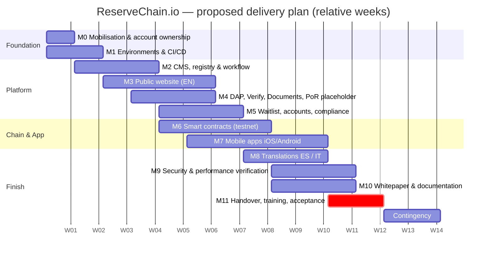

# ReserveChain.io — Development Schedule

> **Status:** Proposed plan — subject to final approval. Week numbers are **relative to contract start (W1)**; no calendar dates are assumed. Durations depend on timely provision of ReserveChain inputs (legal structure, asset data, provider selections, account ownership) — see §5.

> **Mandatory disclosure.** ReserveChain is currently in development. No tokens are being offered or sold through this website. Registration of interest does not constitute an investment, token purchase, asset reservation, price reservation, token allocation or entitlement to participate in any future offering. Any future availability will be subject to the final Swiss corporate and legal structure, definitive offering documentation, asset verification, custody arrangements, jurisdictional eligibility, KYC/KYB, sanctions screening and final approval.

---

## 1. Definition of "complete"

Per the brief, a milestone is complete only when **all** of the following are true:

1. **Implementation** — functionality built in the ReserveChain-owned repository.
2. **Deployment** — deployed to Staging (and, where applicable, Production) from CI using the documented runbook.
3. **Demonstration** — shown live to ReserveChain in a recorded session.
4. **Testing** — the relevant `TEST-PLAN.md` cases executed with results recorded (pass/fail, evidence).
5. **Documentation** — manuals/runbooks for the feature updated and delivered.
6. **Independent verification** — verified by a ReserveChain-nominated reviewer (or third party where specified, e.g. smart-contract audit) against acceptance criteria.
7. **Formal owner acceptance** — written sign-off by ReserveChain's authorised representative, recorded in the milestone acceptance log.

Payment/acceptance milestones map 1:1 to the milestones below.

---

## 2. Already done in this contest entry

The entry is a working demonstration, not a mock-up. The following exist in the repository today:

| Area | Delivered in entry | Location |
|---|---|---|
| Local environment | Docker Compose stack (WordPress, MySQL 8, phpMyAdmin) | `docker-compose.yml` |
| Public website | Theme with Home, program pages (Cu 29 / Ni 28), registry, passports, verify, custody, PoR (placeholder state), tokenization, redemption (proposed), enterprise, documents, roadmap, governance, FAQ, contact, waitlist, legal notices; disclosure banner; Claim Status pills | `wordpress/themes/reservechain/` |
| Registry & CMS | Registry CPTs (programs, lots, batches, containers, coils, laboratories, CoAs, custody, valuations, insurance, reserve reports, token programs, redemptions, documents) with nullable fields | `wordpress/plugins/reservechain-core/` |
| Digital Asset Passports | Passport pages with QR, timeline, evidence ledger, SHA-256 fingerprints, Merkle root, pending states | plugin + theme |
| Client-side Verify | Browser SHA-256 hashing + `GET /verify?hash=` | theme + plugin |
| Waitlist | Form with EU/EEA restriction logic, honeypot, rate limit, consent hash, double opt-in | plugin |
| Audit trail | Hash-chained `rc_audit_log`, MySQL triggers blocking UPDATE/DELETE, "Verify chain integrity" tool | plugin |
| Workflow | Four-eyes Draft → Under Review → Approved → Published → Unpublished → Archived; custom roles | plugin |
| Compliance | Jurisdictions, KYC/KYB/AML/sanctions status model, site modes, module flags (sensitive modules off) | plugin |
| REST API | `/wp-json/rc/v1` endpoints per SPEC | plugin |
| Smart contracts | ReserveToken, ComplianceRegistry, RedemptionManager, ReserveGuard, Treasury, AuditAnchor with Hardhat tests and config-driven deploy scripts (testnet only) | `contracts/` |
| Mobile app | Expo / React Native TypeScript source (programs, passports, verify, account, MFA, notifications; wallet/holdings inactive) with EAS config | `mobile/` |
| Documentation | Architecture, CMS structure, schedule, traceability, security, backup/DR, runbooks, handover checklist, test plan, whitepaper (MD/DOCX/PDF) | `docs/` |

What is **not** done (by design or because inputs are missing): production hosting, real asset data, provider integrations (KYC, email, analytics), third-party audits, app-store submission, translations approved by counsel, any mainnet deployment (out of scope).

---

## 3. Milestone plan (12 weeks + 2 weeks contingency)

| # | Milestone | Weeks | Key deliverables | Acceptance criteria (in addition to §1) |
|---|---|---|---|---|
| M0 | Mobilisation & account ownership | W1 | ReserveChain-owned GitHub org, cloud accounts, domain/DNS access, Apple/Google developer accounts, secrets manager; kickoff; confirm inputs list | All accounts created **in ReserveChain's name** with contractor as invited member only; access log recorded |
| M1 | Environments & CI/CD | W1–W2 | Dev/Staging/Prod separation, IaC (Terraform), CI pipelines, WAF/CDN, backups configured, monitoring | Staging reachable behind auth; pipeline green; first backup + restore test logged |
| M2 | CMS, registry & workflow hardening | W2–W4 | Demo plugin hardened: migrations, all entities, four-eyes, roles, audit log + triggers, anchoring job, admin UX, i18n scaffolding | CMS permission tests pass; integrity verification passes; tamper test shows trigger block |
| M3 | Public website (EN) | W3–W6 | All sections per brief, accessibility WCAG 2.2 AA, performance budgets, legal notices, cookie/consent | Lighthouse ≥ 90 perf/a11y/best-practices on key pages; axe zero critical; cross-browser matrix pass |
| M4 | DAP, Verify, Documents, PoR (placeholder) | W4–W6 | Passport generation, QR, Merkle roots, evidence ledger, document pipeline (scan, hash, signed URLs) | Hash of uploaded file matches public fingerprint; infected test file quarantined |
| M5 | Waitlist, accounts, compliance controls | W5–W7 | Waitlist double opt-in, EU/EEA logic, member accounts with MFA (flag-gated), eligibility model, provider integration stubs | EU country yields `restricted`; consent hash stored; MFA enforced for staff |
| M6 | Smart contracts (testnet) | W5–W8 | Contracts finalised, ≥ 95 % line coverage, Slither clean (or justified), Sepolia deployment, Safe multisig role assignment, admin procedures | Tests + coverage report; verified source on explorer; roles held by Safe; mainnet **not** deployed |
| M7 | Mobile apps (iOS/Android) | W6–W10 | Expo app feature-complete per scope; EAS builds; TestFlight + Play internal testing; store listing drafts | Builds installable on device matrix; config flags respected; inactive modules hidden |
| M8 | Translations ES / IT | W8–W10 | Strings extracted, translations loaded, legal texts marked "pending counsel approval" | Language switcher works across site + app; no untranslated strings in key flows |
| M9 | Security & performance verification | W9–W11 | Internal security review, dependency/image scans, pen-test support (vendor TBD), load test, backup/restore & DR drill, rollback drill | No open critical/high findings; RTO/RPO met in drill; rollback < 15 min |
| M10 | Whitepaper & documentation finalisation | W9–W11 | Whitepaper updated with ReserveChain-provided facts, all manuals, diagram sources | ReserveChain legal review comments resolved |
| M11 | Handover, training & owner acceptance | W11–W12 | Repo transfer, credential handover, recorded training sessions, `HANDOVER-CHECKLIST.md` completed | Every checklist item signed; contractor access revoked; formal acceptance |
| — | Contingency / warranty buffer | W13–W14 | Defect fixes, store review iterations | — |

---

## 4. Gantt

> Axis shows relative weeks (W01 = contract start). The underlying dates in the chart source are placeholders used only to drive the rendering.

---

## 5. Dependencies on ReserveChain (critical path inputs)

| Input | Needed by | Impact if late |
|---|---|---|
| Account creation in ReserveChain's name (GitHub, cloud, domain registrar, Apple Developer, Google Play, email, analytics) | W1 | Blocks M1 and store submissions |
| Hosting option & region decision | W1 | Blocks M1 |
| Approved brand assets and copy owner | W3 | Delays M3 |
| Asset specifications, lab, custodian, insurer, attestor details | Any time — site ships with placeholders | Placeholders remain; no impact on delivery, only on content |
| KYC/KYB/AML provider selection | W5 | Integration remains stubbed |
| Multisig signer addresses & threshold | W7 | Roles stay with deployer on testnet until provided |
| Counsel-approved legal texts (EN/ES/IT) | W9 | Legal pages remain marked draft |
| Pen-test and smart-contract audit vendors | W8 | M9 independent verification partially deferred |

---

## 6. Governance of the schedule

Weekly status report (progress, risks, decisions needed); fortnightly demo on Staging; change requests logged and estimated before work starts; milestone acceptance log kept in the repository (`docs/acceptance/`, created at M0).
