# ReserveChain

## Industrial-Metals Reserve Registry and Tokenization Framework

**Institutional Whitepaper — Discussion Draft**
Version: Draft 0.9 — subject to legal review and final approval
Date of this version: [To be inserted on approval by ReserveChain]

---

## Important Notice

> **Mandatory disclosure.** ReserveChain is currently in development. No tokens are being offered or sold through this website. Registration of interest does not constitute an investment, token purchase, asset reservation, price reservation, token allocation or entitlement to participate in any future offering. Any future availability will be subject to the final Swiss corporate and legal structure, definitive offering documentation, asset verification, custody arrangements, jurisdictional eligibility, KYC/KYB, sanctions screening and final approval.

> **EU/EEA notice.** ReserveChain does not currently intend to offer tokens to residents of, or persons located in, the EU/EEA.

This document is a discussion draft describing a **proposed** platform and **proposed** operating frameworks. It is published for information only. It is not a prospectus, offering memorandum, key information document, or any other form of offering document, and it has not been reviewed or approved by any supervisory authority in any jurisdiction.

Nothing in this document constitutes an offer to sell, a solicitation of an offer to buy, or a recommendation in respect of any token, security, commodity, derivative or other instrument. No token described in this document has been issued on any production blockchain. Any smart contracts referred to have been deployed, if at all, only to public **test networks** for demonstration and testing.

The legal entity that may operate the platform is a **proposed Swiss structure**. No representation is made that such an entity has been formed, licensed, registered or authorised. References to other jurisdictions are for context only.

Throughout this document, information that has not yet been provided or verified is shown as an explicit placeholder — for example **[To be provided by ReserveChain]** or **Pending — subject to final approval**. Placeholders must not be read as implying that the corresponding arrangement exists. In particular, **no custody, insurance, Proof of Reserves, liquidity, redemption right, ownership right or economic return is confirmed** by this document.

Forward-looking statements (including words such as "proposed", "planned", "intended", "may", "would") reflect current intentions only and are subject to change, to legal and regulatory constraints, and to risks described in the *Risk Factors* section.

Recipients should obtain independent legal, tax, regulatory and financial advice before making any decision in relation to the matters described.

---

## Table of Contents

1. Abstract
2. The Problem: Trust in Physical-Asset Representations
3. Project Model
4. The Metal Programs
5. Proposed Legal, Custody and Reserve Frameworks
6. Digital Asset Passport and Evidence Model
7. Token Architecture
8. Tokenomics Framework
9. Governance
10. Technology Platform
11. Security
12. Compliance
13. Redemption (Proposed Process)
14. Proof of Reserves (Proposed)
15. Roadmap
16. Risk Factors
17. Glossary
18. Document Control

---

## 1. Abstract

ReserveChain is an in-development platform designed to register, evidence and — only if and when legally authorised — represent on a blockchain specific physical lots of two industrial metals: **ultra-high-purity copper powder** (program identity **Cu 29**) and **high-purity nickel wire** (program identity **Ni 28**).

The platform's central proposition is that a token representing a physical asset is only as credible as the evidence behind it. ReserveChain therefore puts the **evidence layer first**: an asset registry of lots, batches, containers and coils; a library of certificates of analysis, custody records, insurance documents, valuations and reserve reports, each fingerprinted with SHA-256; a **Digital Asset Passport (DAP)** for every registered physical unit, with a lifecycle timeline, an evidence ledger and a Merkle root summarising all supporting documents; and a **tamper-evident audit trail** whose state can be anchored on a public blockchain.

On top of that evidence layer, ReserveChain has designed a **token architecture** based on audited open-source building blocks (OpenZeppelin Contracts v5) with compliance-gated transfers, a reserve-gated mint ceiling that is fail-closed by default, a proposed redemption workflow, a role-controlled treasury and an audit-anchoring contract. All economic parameters — supply, asset-to-token ratio, price, redemption thresholds, allocations — are **unset** and remain **to be determined, subject to written approval**. The token, wallet, purchase, Proof-of-Reserves and redemption features are implemented as **inactive modules**, switched off until authorised.

Every factual claim on the platform carries a visible **Claim Status** — *proposed*, *in development*, *pending verification*, *verified* or *not applicable* — so that readers can distinguish intention from evidence at a glance.

---

## 2. The Problem: Trust in Physical-Asset Representations

Digital representations of physical commodities promise operational benefits: fractional record-keeping, faster transfer of entitlements, programmable compliance and continuous transparency. In practice, many such representations have suffered from recurring weaknesses:

1. **Opaque backing.** Statements that tokens are "backed" by physical assets are often supported by infrequent, high-level attestations that do not identify specific lots, specifications, locations or custodians.
2. **Claim inflation.** Marketing materials frequently describe arrangements (insurance, audited reserves, redemption rights) as existing when they are only planned.
3. **Unverifiable documents.** Certificates and reports are published as images or PDFs without any mechanism for a reader to confirm that the document they hold is the one the issuer relied on.
4. **Mutable records.** Off-chain databases can be silently altered; on-chain tokens can be minted without reference to off-chain reality.
5. **Weak separation of duties.** The same individual can often draft, approve and publish material claims.

Industrial metals add further complexity. Unlike investment-grade bullion, materials such as metal powders and fine wire are defined by technical specifications (chemistry, purity, particle size or diameter, packaging and handling conditions) that matter to their industrial value and must be evidenced by competent laboratories.

ReserveChain's design responds to each weakness with a specific control, summarised below and detailed in later sections.

| Weakness | ReserveChain proposed control |
|---|---|
| Opaque backing | Unit-level registry and Digital Asset Passports |
| Claim inflation | Claim Status System; placeholders instead of assumptions; four-eyes approval |
| Unverifiable documents | SHA-256 fingerprints; client-side verification; Merkle roots |
| Mutable records | Append-only, hash-chained audit trail with database triggers and on-chain anchoring |
| Mint without reality | Reserve-gated mint ceiling, fail-closed by default |
| Weak separation of duties | Role-based access, four-eyes workflow, multisig administration (intended) |

---

## 3. Project Model

### 3.1 Overview

ReserveChain is conceived as a **turnkey registry and tokenization platform** with three layers:

- **Evidence layer** (off-chain, system of record): registry, documents, passports, audit trail.
- **Control layer**: editorial workflow, roles, compliance controls, site modes and module flags.
- **Representation layer** (on-chain, testnet in this phase): token, compliance registry, reserve guard, redemption manager, treasury and audit anchor.

<!-- diagram: 01-platform-overview -->
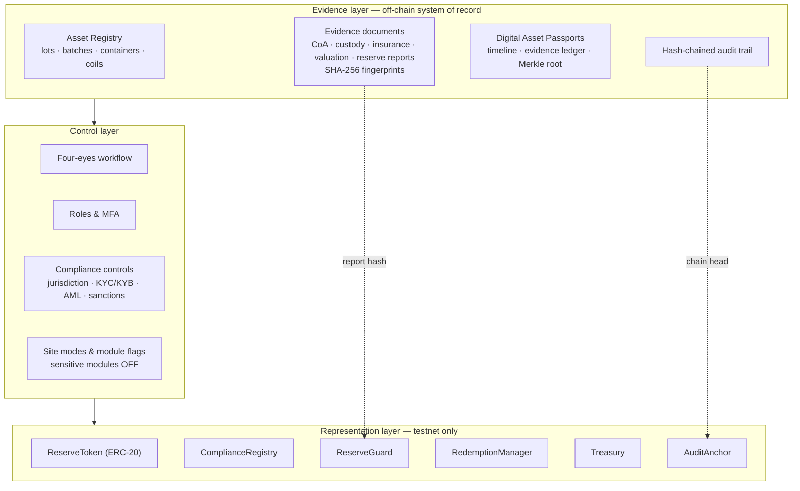

### 3.2 Participants (proposed)

| Participant | Role | Status |
|---|---|---|
| ReserveChain operating entity | Platform operator, registry owner | Proposed Swiss structure — **Pending — subject to final approval** |
| Producers / refiners | Supply of material | **[To be provided by ReserveChain]** |
| Independent laboratories | Certificates of analysis | **[To be provided by ReserveChain]** |
| Custodian(s) / warehouse operator(s) | Safekeeping, receipts | **[To be provided by ReserveChain]** |
| Insurer(s) | Coverage of stored material | **[To be provided by ReserveChain]** |
| Independent attestor / auditor | Reserve reporting | **[To be appointed by ReserveChain]** |
| KYC/KYB/AML/sanctions provider | Eligibility screening | **[To be decided by ReserveChain]** |
| Multisig signers | On-chain administration | **[To be provided by ReserveChain]** |
| Eligible participants | Prospective token holders | Not applicable — no offering exists |

### 3.3 Proposed lifecycle

<!-- diagram: 02-asset-lifecycle -->
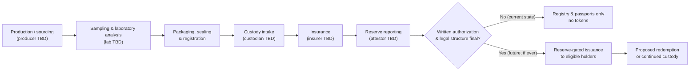

At present ReserveChain operates only in the state labelled *"Registry & passports only — no tokens"*.

---

## 4. The Metal Programs

> This section describes the two materials in general industrial terms only. **No specification, purity figure, quantity, origin, price or counterparty for ReserveChain's own assets is stated or implied.** Asset-specific data will be published in the registry and Digital Asset Passports only when provided and evidenced.

### 4.1 Copper Powder — Cu 29

**General industrial context.** Copper is valued for its high electrical and thermal conductivity. In powder form, copper is used across a range of industrial processes, including powder metallurgy (pressed and sintered components), additive manufacturing, electrically and thermally conductive pastes and inks, brazing materials, friction materials, and electronics and thermal-management applications. Performance in these uses typically depends on chemical purity, oxygen content, particle size distribution, particle morphology, apparent density and flowability, and on handling conditions that limit oxidation.

**ReserveChain program parameters.**

| Parameter | Value | Claim status |
|---|---|---|
| Material form | **[To be provided by ReserveChain]** | Proposed |
| Target purity grade | **Pending — to be confirmed by laboratory analysis** | Pending verification |
| Specification standard | **Pending — standard to be confirmed** | Proposed |
| Particle size distribution | **Pending — laboratory analysis required** | Pending verification |
| Packaging and atmosphere | **[To be provided by ReserveChain]** | Proposed |
| Producer / origin | **Pending — producer to be disclosed** | Proposed |
| Quantity in program | **[To be provided by ReserveChain]** | Proposed |
| Unit of account | **Not yet determined** | Proposed |
| Laboratory | **Laboratory to be appointed** | Proposed |
| Custodian / location | **Custodian to be appointed — subject to final approval** | Proposed |
| Insurance | **Insurance not yet arranged — subject to final approval** | Proposed |

### 4.2 Nickel Wire — Ni 28

**General industrial context.** Nickel is used for its corrosion resistance, its behaviour at elevated temperatures and its electrical and magnetic properties. High-purity nickel wire is used in applications such as electronic and electrical components, lead wires, battery connections, heating and resistance elements (often in alloy form), vacuum and lighting technology, chemical-processing equipment, and as feedstock for specialised alloys and thermal spray. Relevant characteristics typically include chemical purity, diameter and tolerance, temper/annealing condition, surface finish, tensile properties and spool or coil format.

**ReserveChain program parameters.**

| Parameter | Value | Claim status |
|---|---|---|
| Material form | **[To be provided by ReserveChain]** | Proposed |
| Target purity grade | **Pending — to be confirmed by laboratory analysis** | Pending verification |
| Specification standard | **Pending — standard to be confirmed** | Proposed |
| Wire diameter / tolerance | **Pending — laboratory analysis required** | Pending verification |
| Temper / condition | **[To be provided by ReserveChain]** | Proposed |
| Coil / spool format | **[To be provided by ReserveChain]** | Proposed |
| Producer / origin | **Pending — producer to be disclosed** | Proposed |
| Quantity in program | **[To be provided by ReserveChain]** | Proposed |
| Laboratory | **Laboratory to be appointed** | Proposed |
| Custodian / location | **Custodian to be appointed — subject to final approval** | Proposed |
| Insurance | **Insurance not yet arranged — subject to final approval** | Proposed |

### 4.3 Why unit-level registration matters for industrial metals

Industrial materials are not fungible in the way that standardised bullion bars are. Two lots of nominally identical copper powder may differ in particle size distribution or oxygen content, and two coils of nickel wire may differ in temper or diameter tolerance. ReserveChain's proposed registry therefore tracks **specific physical units** — lots, batches, containers and coils — each with its own evidence and passport, rather than an undifferentiated pool. Any future token program would need to define, in its offering documentation, exactly which registered units it relates to and how differences between units are treated. That definition is **[To be determined — subject to written approval]**.

---

## 5. Proposed Legal, Custody and Reserve Frameworks

> All arrangements in this section are **proposed**. None is in place. Their final form depends on legal advice, regulatory analysis and commercial agreements that have not been concluded.

### 5.1 Corporate and legal structure

ReserveChain intends to operate through a **proposed Swiss structure**. The legal form, registered office, governing bodies, licensing analysis and any required registrations are **Pending — subject to final approval**. References elsewhere to other jurisdictions (including Estonia) are for context only; no entity is represented as formed in any jurisdiction.

Key legal questions to be resolved by ReserveChain's counsel before any token issuance include:

| Question | Status |
|---|---|
| Legal characterisation of any token (e.g. ledger-based security, payment token, utility, other) under applicable law | Pending — subject to legal analysis |
| Holder rights (ownership, claim, entitlement to delivery, none) | Not yet determined — subject to final legal structure |
| Bankruptcy remoteness / segregation of physical assets | Pending — subject to legal analysis |
| Licensing or registration requirements (including AML self-regulatory organisation membership, if applicable) | Pending — subject to legal analysis |
| Offering documentation and investor categories | Pending — subject to final approval |
| Target jurisdictions and exclusions (EU/EEA currently excluded by intention) | Pending — subject to final approval |
| Tax treatment | Pending — subject to advice |

### 5.2 Custody framework (proposed)

The proposed custody model aims to give each registered physical unit an evidenced chain of custody:

1. **Custody intake** — receipt of sealed units by a custodian or warehouse operator, with a receipt identifying unit IDs and seal numbers.
2. **Segregation** — physical and book-entry segregation of program material from other holdings (type of segregation **[To be determined]**).
3. **Periodic inspection** — counts and seal checks by the custodian and, where agreed, by an independent inspector.
4. **Transfers and releases** — every movement recorded as a custody record linked to the unit's passport.
5. **Environmental controls** — storage conditions appropriate to the material (e.g. humidity and oxidation control for fine powders), to be specified with the custodian.

| Element | Value |
|---|---|
| Custodian(s) | **[To be provided by ReserveChain]** |
| Facility location(s) | **[To be provided by ReserveChain]** — public disclosure level to be decided |
| Custody agreement | **Pending — subject to final approval** |
| Warehouse receipt form | **[To be provided by ReserveChain]** |
| Legal owner of the material | **Pending — subject to final legal structure** |

### 5.3 Insurance framework (proposed)

ReserveChain intends to seek insurance appropriate to stored industrial materials (e.g. property/all-risk while in custody, and transit cover during movements). Insurer, coverage type, sum insured, exclusions and policy period are **[To be provided by ReserveChain]**. Until a certificate of insurance is registered and verified, the platform displays *"Insurance not yet arranged — subject to final approval."*

### 5.4 Reserve framework (proposed)

The proposed reserve framework links three items for each program:

- **Registered units** — the set of Published registry units (with passports) designated to the program;
- **Reserve reports** — periodic statements by an independent attestor of the units held, with the report document fingerprinted;
- **Outstanding representation** — tokens outstanding, if any (currently: none).

Any future issuance would be limited by the reserve-gated mint ceiling (Section 7.4). The attestor, reporting frequency, procedures (e.g. agreed-upon procedures vs. assurance engagement) and acceptance criteria are **[To be determined — subject to written approval]**.

---

## 6. Digital Asset Passport and Evidence Model

### 6.1 Registry hierarchy

<!-- diagram: 03-registry-hierarchy -->
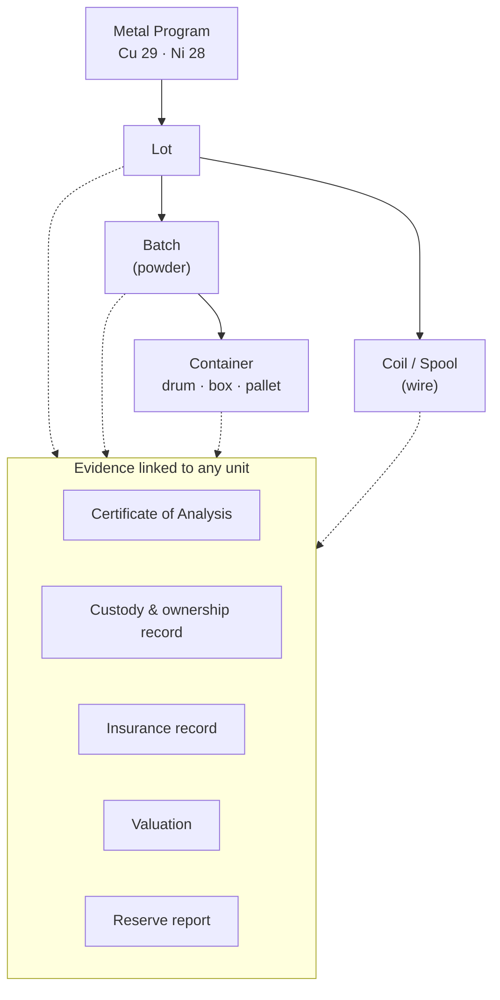

Every registry record carries a **verification status** (Claim Status) and a **workflow state**. Only records that have passed four-eyes review and are in the *Published* state are visible publicly.

### 6.2 The Digital Asset Passport

A Digital Asset Passport is generated for every Published lot, batch, container and coil. It contains:

| Section | Content |
|---|---|
| Identity | Passport number, entity type, program, registry number, QR code |
| Fields | Every public attribute with its value **or** its explicit pending text, plus a Claim Status per field |
| Completeness | Share of public fields that have evidenced values — gaps are displayed, not hidden |
| Timeline | Lifecycle events derived from evidence (analysis, intake, transfers, reports) |
| Evidence ledger | Linked documents with type, issuer (or "Not yet provided"), status and SHA-256 fingerprint |
| Custody | Custody and ownership records |
| Merkle root | A single SHA-256 commitment over all evidence fingerprints |
| Anchoring | Reference to on-chain anchor, where enabled |

### 6.3 Fingerprinting and Merkle commitment

Each evidence document is hashed with SHA-256 at ingest. The hash is stored with the document record and becomes immutable once the document is Published. For each passport, the sorted list of evidence fingerprints forms the leaves of a Merkle tree; its root is displayed on the passport.

<!-- diagram: 04-evidence-merkle -->
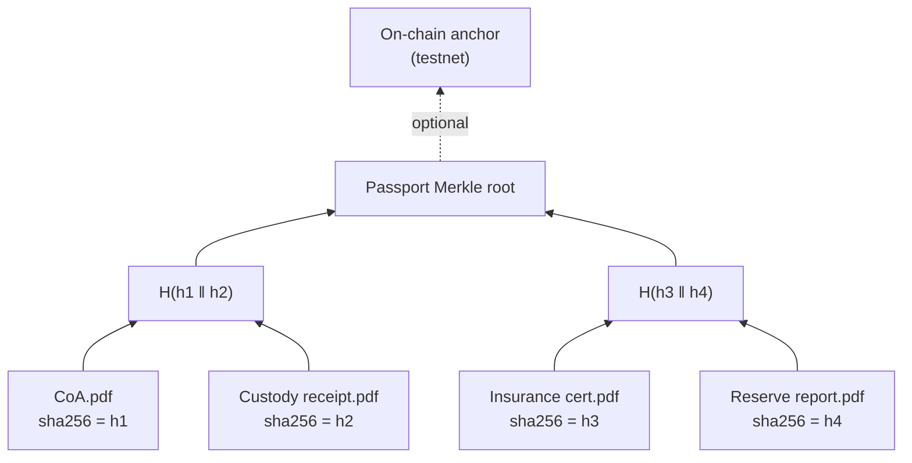

Properties:

- Changing, adding or removing any evidence document changes the passport's Merkle root.
- A third party holding a document can prove its inclusion with a short Merkle proof without the issuer disclosing other documents.
- Anchoring a root (or the audit-trail head that records it) on a public chain fixes it in time.

### 6.4 Client-side verification

Any visitor can verify a document they hold: the file is hashed **locally in the browser** (or app) using the Web Crypto API; only the 64-character hash is sent to the registry's verification endpoint, which responds whether the fingerprint matches a registered document and, if so, which passport it belongs to. The file itself is never uploaded.

<!-- diagram: 05-client-verify -->
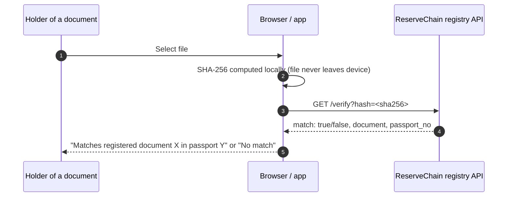

### 6.5 Claim Status System

| Status | Meaning | Who may set |
|---|---|---|
| Proposed | Intended arrangement, not yet in progress | Editors / registry managers |
| In development | Work under way, not complete | Editors / registry managers |
| Pending verification | Evidence submitted, not yet verified | Registry managers |
| Verified | Evidence reviewed and accepted under four-eyes control | Compliance approval only |
| Not applicable | Does not apply in the current phase | Editors with review |

---

## 7. Token Architecture

> Contracts described here exist as source code with automated tests and are intended for **test networks only** (Ethereum Sepolia by default; Polygon Amoy optional). **Mainnet deployment is not performed.** No token has been issued to any person.

### 7.1 Contract suite

<!-- diagram: 06-token-architecture -->
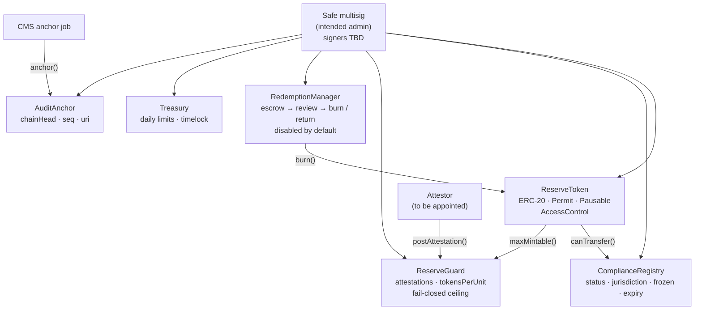

| Contract | Purpose | Key properties |
|---|---|---|
| **ReserveToken** | ERC-20 representation (if ever authorised) | OpenZeppelin v5; ERC20Permit; Pausable; roles MINTER, BURNER, PAUSER, COMPLIANCE_ADMIN, TREASURY, DEFAULT_ADMIN; name, symbol, decimals and supply cap from configuration; optional compliance hook and reserve guard; document URI + hash reference |
| **ComplianceRegistry** | On-chain eligibility flags | Per-address status, two-letter jurisdiction code, frozen flag, expiry; blocked-jurisdiction list; roles KYC_OPERATOR and JURISDICTION_ADMIN; **no personal data on-chain** |
| **ReserveGuard** | Reserve-gated mint ceiling | Attestor posts `(programId, units, reportHash, uri, asOf)`; ceiling = units × tokensPerUnit; staleness window; **returns zero unless fully configured** |
| **RedemptionManager** | Proposed redemption workflow | Request escrows tokens; operator approves (burn) or rejects (return); min/max thresholds; **disabled by default** |
| **Treasury** | Role-controlled holdings | Per-token daily limits; optional timelocked withdrawals; pausable |
| **AuditAnchor** | Anchors the CMS audit-trail head | Monotonic sequence numbers; `verify(seq, chainHead)`; ANCHOR_ROLE only |

### 7.2 Roles and separation of duties

| Role | Contract | Intended holder |
|---|---|---|
| DEFAULT_ADMIN (with delayed transfer rules) | All | Safe multisig — **signers and threshold [To be provided by ReserveChain]** |
| MINTER | ReserveToken | Multisig; minting additionally bounded by ReserveGuard |
| BURNER | ReserveToken | RedemptionManager / multisig |
| PAUSER | ReserveToken, RedemptionManager, Treasury | Multisig and optional emergency signer |
| COMPLIANCE_ADMIN | ReserveToken | Compliance multisig |
| KYC_OPERATOR, JURISDICTION_ADMIN | ComplianceRegistry | Compliance operations |
| ATTESTOR | ReserveGuard | Independent attestor **[To be appointed]** |
| GUARD_ADMIN | ReserveGuard | Multisig |
| REDEMPTION_OPERATOR, CONFIG_ADMIN | RedemptionManager | Operations / multisig |
| TREASURER, LIMIT_ADMIN | Treasury | Multisig |
| ANCHOR_ROLE | AuditAnchor | Platform anchor key (low privilege) |

### 7.3 Compliance-gated transfers

When compliance is enabled on the token, every balance movement — transfers and the recipient side of minting — calls `ComplianceRegistry.canTransfer(from, to, amount)`. A movement is permitted only if the parties are eligible: approved status, not frozen, record not expired, and jurisdiction not on the blocked list. EU/EEA jurisdiction codes are proposed to be blocked by default in line with the EU/EEA notice above. All movements are also blocked while the token is paused.

### 7.4 Reserve-gated minting (fail-closed)

<!-- diagram: 07-reserve-gated-mint -->
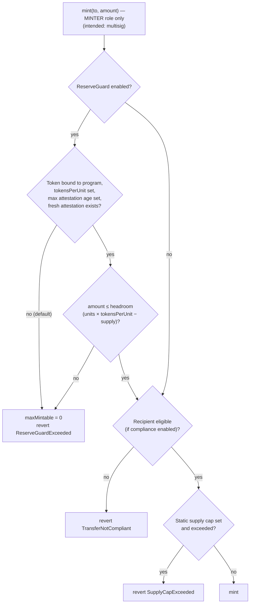

When the ReserveGuard is enabled, its ceiling is zero unless the token is bound to a program, the ratio (`tokensPerUnit`) is set, the staleness window is set and a fresh attestation exists — all of which are **unset by default**. Minting is therefore impossible until each element has been deliberately configured. The intended operating policy is that any token representing registered material is deployed with the ReserveGuard enabled, that the MINTER role is held only by the multisig, and that no minting takes place during the current phase. The reserve ceiling is a technical safeguard; it is **not** itself a Proof of Reserves, which depends on the independence and quality of the attestation behind each posted figure.

### 7.5 Configuration, not code

Token name, symbol, decimals, supply cap, ratio, thresholds and limits are supplied through per-network configuration files and administrative transactions. Nothing economic is hard-coded. Default configuration leaves every economic parameter unset.

---

## 8. Tokenomics Framework

> **No tokenomics have been decided.** The table below is a *framework* listing the parameters that would need to be defined, approved in writing and disclosed in definitive offering documentation before any issuance. Every value is **To be determined — subject to written approval.**

| Parameter | Description | Value |
|---|---|---|
| Token name and symbol | Identifier(s) per program | To be determined — subject to written approval |
| Decimals | Divisibility | To be determined — subject to written approval |
| Unit of account | Physical unit underlying the representation (e.g. mass unit) | To be determined — subject to written approval |
| Asset-to-token ratio | Tokens per unit of registered material | To be determined — subject to written approval |
| Supply cap | Maximum tokens per program | To be determined — subject to written approval |
| Issuance price / pricing methodology | How any issuance price would be set | To be determined — subject to written approval |
| Allocations | Any allocation categories | To be determined — subject to written approval |
| Holder rights | Legal nature of any entitlement | To be determined — subject to final legal structure |
| Redemption minimum / maximum | Thresholds per request | To be determined — subject to written approval |
| Redemption fees and delivery terms | Costs and logistics | To be determined — subject to written approval |
| Custody and insurance cost allocation | How ongoing costs are borne | To be determined — subject to written approval |
| Transfer restrictions | Eligibility rules, lock-ups | To be determined — subject to written approval |
| Secondary transfer venues / liquidity | Any trading arrangements | To be determined — no liquidity is represented |
| Reporting frequency | Reserve report cadence | To be determined — subject to written approval |

ReserveChain makes **no statement** regarding price, value, appreciation, liquidity, yield or return of any future token.

---

## 9. Governance

### 9.1 Principles

1. **Separation of duties** — no single person can author, approve and publish a material claim.
2. **Least privilege** — role-based access in the CMS and on-chain.
3. **Traceability** — every material action is recorded in a tamper-evident audit trail.
4. **Explicit authorization** — sensitive modules require a written authorization reference and two distinct authorised users.
5. **External verifiability** — fingerprints, Merkle roots and audit anchors allow outside parties to check integrity.

### 9.2 Editorial and registry workflow

<!-- diagram: 08-four-eyes-workflow -->
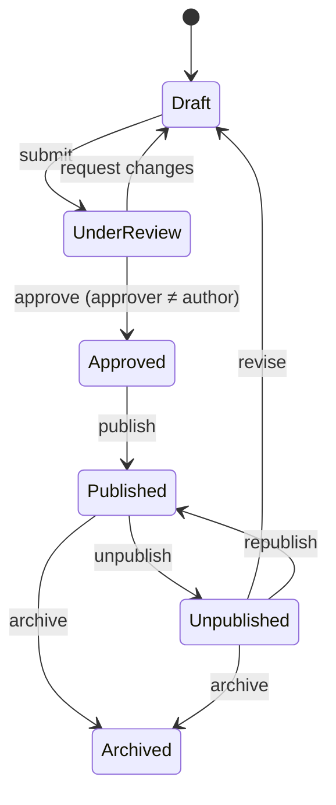

### 9.3 Platform roles

| Role | Responsibility |
|---|---|
| Content editor | Drafts public content; submits for review |
| Registry manager | Creates and maintains registry and evidence records; submits for review |
| Reviewer | Reviews and approves others' submissions |
| Compliance officer | Publishes; approves compliance-sensitive changes; manages jurisdictions, eligibility statuses and waitlist data |
| Auditor | Read-only access; verifies audit-trail integrity; exports evidence |
| Administrator | Platform settings, module authorization (with written reference), audit anchoring |

### 9.4 On-chain governance (intended)

Administrative rights over contracts are intended to be held by a **Safe multisig** whose signers and threshold are **[To be provided by ReserveChain]**. Admin transfers use delayed two-step rules. Emergency pause is available to designated pausers. All role changes are to be mirrored in the CMS audit trail with transaction references.

### 9.5 Corporate governance

Board composition, committees (e.g. risk, compliance), conflicts-of-interest policy and external audit arrangements of the proposed entity are **Pending — subject to final approval**.

---

## 10. Technology Platform

<!-- diagram: 09-technology-stack -->
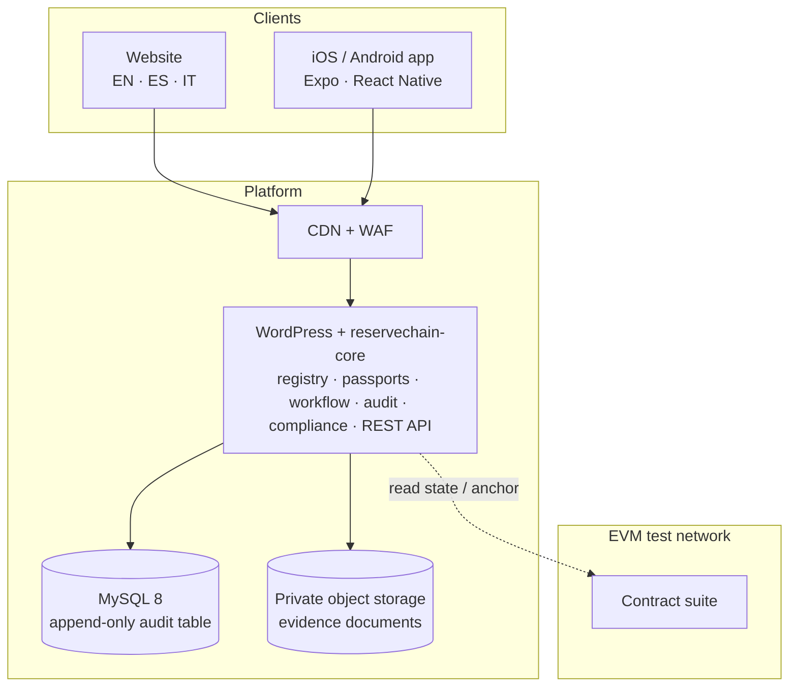

| Component | Technology | Notes |
|---|---|---|
| Website and CMS | WordPress, custom theme and plugin (PHP 8.1+), MySQL 8 | Declarative registry schema; extensible without rebuild |
| REST API | `/wp-json/rc/v1` | Public read-only endpoints; authenticated member endpoints with MFA |
| Mobile apps | Expo / React Native (TypeScript), native builds for iOS and Android | Remote configuration; inactive modules hidden |
| Smart contracts | Solidity, Hardhat, OpenZeppelin Contracts v5 | Testnet only |
| Languages | English, Spanish, Italian | Legal texts subject to counsel-approved translation |
| Environments | Development, Staging, Production — strictly separated | Separate data, secrets and access |

**Audit trail.** Each audit entry stores the hash of the previous entry and its own SHA-256 hash over a canonical field sequence. Database triggers reject any UPDATE or DELETE on the audit table. An integrity tool recomputes the entire chain on demand and daily. The latest chain head can be anchored to the AuditAnchor contract; any later rewrite of history becomes detectable against the anchor.

<!-- diagram: 10-audit-anchoring -->
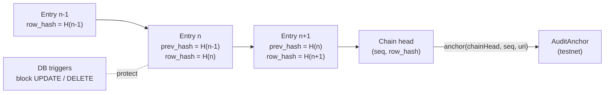

---

## 11. Security

ReserveChain's proposed security programme comprises:

| Domain | Proposed controls |
|---|---|
| Identity | Named accounts; role-based access; mandatory TOTP multi-factor authentication for staff |
| Sessions | Secure, HttpOnly cookies; idle and absolute timeouts; revocation on role change |
| Transport & browser | TLS 1.2+, HSTS, Content Security Policy, hardened headers |
| Application | Prepared statements, output escaping, nonces, capability checks; file editing disabled in production |
| Uploads | Type allow-list, magic-byte validation, malware scanning, private storage, signed URLs, SHA-256 at ingest |
| Abuse | Edge WAF, rate limiting, honeypots, optional challenge |
| Secrets | Secrets manager; no secrets in source; scheduled rotation |
| Data protection | Hashed IPs and emails for de-duplication; PII restricted to compliance roles; KYC documents held by provider, not by the platform |
| Backups | 3-2-1 strategy with immutable off-site copy; scheduled restore drills |
| Monitoring | Uptime, error rates, integrity job, backup status, certificate expiry |
| Vulnerability management | Dependency and image scanning; static analysis (PHP and Solidity); external penetration test and smart-contract audit **[firms to be appointed by ReserveChain]** |
| Incident response | Severity model; maintenance mode; contract pause via multisig; evidence preservation against on-chain anchors |
| Keys | Hardware-backed multisig for contract administration; low-privilege anchor key; deployer admin renounced after deployment |

No security control eliminates risk. External audits and penetration tests have **not yet been performed**.

---

## 12. Compliance

### 12.1 Eligibility controls

Any future participation would require, at minimum: identity verification (KYC) for individuals, business verification (KYB) for entities including beneficial owners, AML risk assessment, sanctions and politically-exposed-person screening, and jurisdictional eligibility. The provider is **[To be decided by ReserveChain]**. The platform currently stores only **status values** (not started, pending, approved, rejected) per member; documents remain with the provider.

<!-- diagram: 11-compliance-gating -->
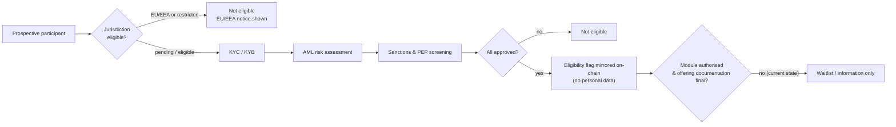

### 12.2 Jurisdictions

- **EU/EEA:** ReserveChain does not currently intend to offer tokens to residents of, or persons located in, the EU/EEA. EU/EEA registrations of interest are recorded as *restricted* and receive general updates only if they opt in.
- **Other jurisdictions:** eligibility is **Pending — subject to legal analysis**. Sanctioned jurisdictions would be blocked.

### 12.3 Registration of interest

The waitlist collects name, email, country, entity type, optional organisation, program interest and language, together with explicit consent to the disclosure and privacy notice. The version and SHA-256 hash of the consent text are recorded. Double opt-in confirmation is required. **Registration of interest creates no entitlement of any kind** (see Important Notice).

### 12.4 Data protection

The platform is designed for data minimisation: hashed identifiers in logs, restricted access to personal data, export and erasure procedures, and retention periods **[To be defined by ReserveChain counsel]** under applicable law (including the Swiss Federal Act on Data Protection and, where applicable, the GDPR).

### 12.5 Communication standards

Public materials use the terms *proposed*, *planned*, *in development* and *subject to final approval*. They do not describe any arrangement as confirmed unless it has been verified through the four-eyes process with evidence, and they do not use language of investment, profit or return.

---

## 13. Redemption (Proposed Process)

> Redemption is a **proposed** feature. It is **disabled** in the platform and in the RedemptionManager contract. No redemption right exists. Thresholds, fees, delivery terms, eligible locations and timelines are **To be determined — subject to written approval**.

<!-- diagram: 12-redemption-flow -->
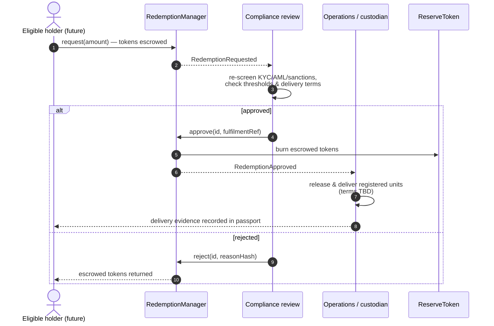

Design properties of the proposed process: tokens are escrowed (not burned) until approval, so a rejection is fully reversible; approvals and rejections are recorded on-chain with a fulfilment reference or reason hash; the corresponding CMS redemption record mirrors the state; physical release would be evidenced by custody records attached to the affected passports.

---

## 14. Proof of Reserves (Proposed)

> Proof of Reserves is a **proposed** feature and is **inactive**. No reserve attestation has been published. No attestor has been appointed.

The proposed approach combines four elements:

1. **Unit-level registry** — reserves are identified as specific registered units with passports, not as an aggregate figure alone.
2. **Independent attestation** — an attestor **[To be appointed by ReserveChain]** issues periodic reports covering the registered units; each report is fingerprinted and registered.
3. **On-chain posting** — the attestor posts the attested quantity, the report hash and its URI to ReserveGuard; the mint ceiling is derived from the most recent fresh attestation.
4. **Public reconciliation** — a reserves page would display, per program, the attested units, report date, attestor, report fingerprint, on-chain transaction, and tokens outstanding (currently: *Not applicable — no tokens issued*).

<!-- diagram: 13-proof-of-reserves -->
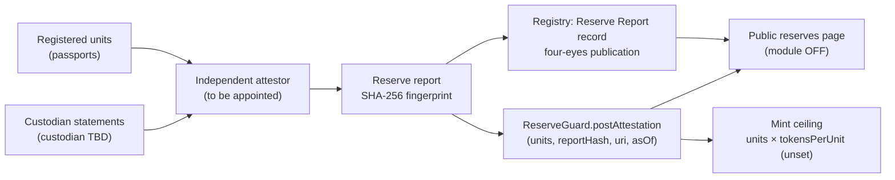

Limitations: an on-chain attestation records a statement by a key holder; its reliability depends entirely on the independence, competence and procedures of the attestor and the custodian. A reserve report at a point in time does not guarantee reserves at other times.

---

## 15. Roadmap

> The roadmap is **phase-based**. No dates are given; timing depends on legal, regulatory, commercial and technical dependencies, many outside ReserveChain's control. Completion of any phase does not imply that later phases will occur.

<!-- diagram: 14-roadmap -->
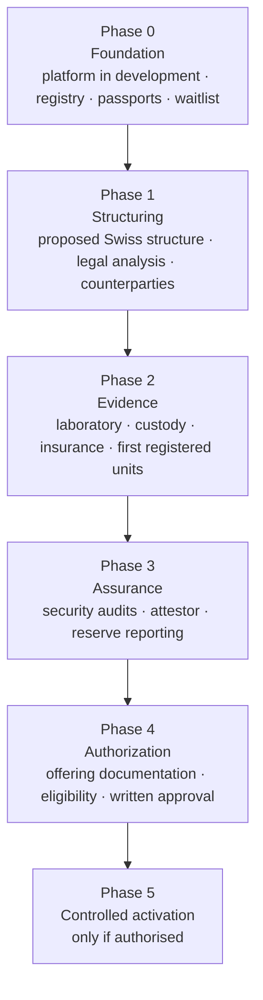

| Phase | Objectives | Status |
|---|---|---|
| 0 — Foundation | Website, CMS, registry, Digital Asset Passports, audit trail, waitlist, testnet contracts, mobile app source, documentation | In development |
| 1 — Structuring | Corporate and legal structure; regulatory analysis; selection of providers | Proposed |
| 2 — Evidence | Laboratory, custody and insurance arrangements; first units registered with evidence | Proposed |
| 3 — Assurance | Penetration test, smart-contract audit, attestor appointment, first reserve report | Proposed |
| 4 — Authorization | Definitive offering documentation; eligibility framework; written approvals | Proposed |
| 5 — Controlled activation | Activation of gated modules only if all prior conditions are met | Proposed — subject to final approval |

---

## 16. Risk Factors

The following non-exhaustive risks apply to the project and to any future representation of physical metals. They should be read together with the Important Notice.

### 16.1 Project and structural risks

- **Development risk.** The platform is in development; features may change, be delayed or never be completed.
- **Entity risk.** The proposed Swiss structure has not been formed or authorised; it may not be formed, or may be formed in a different form or jurisdiction.
- **Counterparty-selection risk.** Laboratories, custodians, insurers, attestors and service providers have not been appointed; suitable counterparties may not be available on acceptable terms.
- **Funding and continuity risk.** The project may lack resources to complete development or operate the platform.
- **Key-person risk.** The project may depend on a small number of individuals.

### 16.2 Legal and regulatory risks

- **Characterisation risk.** Tokens may be characterised as securities, financial instruments, deposits, commodities derivatives or other regulated products, with licensing, prospectus and conduct consequences.
- **Regulatory change.** Laws on crypto-assets, tokenised securities, AML, sanctions and data protection are evolving and may restrict or prohibit the proposed activities.
- **Jurisdictional restrictions.** Persons in the EU/EEA and potentially other jurisdictions will not be eligible; eligibility rules may change.
- **Enforceability.** Holder rights (if any) may be uncertain or unenforceable in some jurisdictions or in insolvency.
- **Sanctions and AML.** Counterparties, sourcing or participants could become subject to sanctions, triggering freezes or exclusions.

### 16.3 Asset and custody risks

- **Specification risk.** Material may not meet target specifications; laboratory results may vary between methods and laboratories.
- **Degradation risk.** Fine metal powders can oxidise or absorb moisture; wire can be damaged or corrode; storage conditions matter.
- **Custody risk.** Loss, theft, fraud, misallocation, commingling, or custodian insolvency.
- **Insurance risk.** Insurance may be unavailable, insufficient, subject to exclusions or not pay out.
- **Valuation risk.** Industrial metals are subject to price volatility; specialised forms may have thin markets and wide differences between valuation and realisable value. No valuation is published.
- **Provenance and ESG risk.** Sourcing may be subject to responsible-sourcing, environmental and human-rights scrutiny; documentation may be incomplete.
- **Logistics risk.** Transport, export controls, customs, hazardous-material handling and delivery may delay or prevent physical movements.

### 16.4 Reserve and redemption risks

- **Attestation risk.** Attestations are statements at a point in time and depend on the attestor's procedures and independence.
- **Mismatch risk.** Operational errors could cause registry, reserve reports and on-chain state to diverge.
- **Redemption risk.** Redemption may never be available; if available, it may be subject to thresholds, fees, delays, suspension, jurisdiction limits and delivery constraints.

### 16.5 Technology risks

- **Smart-contract risk.** Contracts may contain vulnerabilities despite testing and use of established libraries; audits have not yet been performed.
- **Key-management risk.** Loss or compromise of administrative or signer keys.
- **Blockchain risk.** Network congestion, forks, reorganisations, fee spikes, client bugs, or changes to the underlying network.
- **Oracle / attestor key risk.** A compromised attestor key could post incorrect data (mitigated, not eliminated, by staleness windows, caps and multisig oversight).
- **Platform risk.** Web, CMS, API or app vulnerabilities; third-party dependency compromise; outages.
- **Data risk.** Data loss or corruption despite backups; restoration may lose recent data.

### 16.6 Market and liquidity risks

- **No liquidity.** No secondary market or liquidity arrangement exists or is represented.
- **Price risk.** Any token, if issued, could trade (where permitted) at prices different from any reference value of the underlying material.
- **Concentration risk.** Two programs only; exposure to two metals and to specific forms.

### 16.7 Operational and reputational risks

- **Human error** in data entry or approvals, mitigated but not eliminated by four-eyes controls.
- **Fraud by insiders or counterparties.**
- **Misinformation.** Third parties may misrepresent the project or impersonate it; only official channels **[To be provided by ReserveChain]** should be relied upon.

---

## 17. Glossary

| Term | Definition |
|---|---|
| AML | Anti-money laundering controls and procedures |
| Attestation | A statement by an independent party about the existence and quantity of reserves at a point in time |
| Audit trail | Append-only record of material platform actions, hash-chained for tamper evidence |
| Chain head | The hash of the most recent audit-trail entry together with its sequence number |
| Certificate of Analysis (CoA) | Laboratory document reporting the measured composition/properties of a sample |
| Claim Status | Visible status of a factual claim: proposed, in development, pending verification, verified, not applicable |
| Coil / spool | A wound unit of wire tracked individually in the registry |
| Custody record | Evidence of receipt, holding, transfer or release of a unit by a custodian |
| DAP — Digital Asset Passport | Public, per-unit page showing identity, fields with status, timeline, evidence ledger and Merkle root |
| EEA | European Economic Area (EU member states plus Iceland, Liechtenstein, Norway) |
| ERC-20 | A standard interface for fungible tokens on Ethereum-compatible blockchains |
| Fail-closed | A design in which a control defaults to the most restrictive state when not fully configured |
| Four-eyes principle | Requirement that a second, different authorised person approves a change before it takes effect |
| KYB | Know Your Business — verification of a legal entity and its beneficial owners |
| KYC | Know Your Customer — verification of an individual's identity |
| Merkle root | A single hash committing to a set of hashes, enabling inclusion proofs |
| Multisig | A wallet requiring signatures from multiple keys to execute a transaction |
| PEP | Politically exposed person |
| Proof of Reserves (PoR) | A process for demonstrating that represented assets exist, proposed here as a combination of registry, attestation and on-chain posting |
| ReserveGuard | Contract computing a mint ceiling from attested units and a configured ratio |
| SHA-256 | Cryptographic hash function producing a 256-bit fingerprint |
| Testnet | A public blockchain network used for testing, whose tokens have no economic value |
| Waitlist | Registration of interest; creates no entitlement |

---

## 18. Document Control

| Item | Value |
|---|---|
| Document | ReserveChain Institutional Whitepaper — Discussion Draft |
| Version | Draft 0.9 |
| Status | In development — subject to legal review and final approval |
| Owner | ReserveChain **[responsible person to be provided]** |
| Approval | **Pending — subject to final approval** |
| Distribution | Information only; not an offering document |
| Diagram sources | `docs/whitepaper/diagrams/*.mmd` |
| Build | `docs/whitepaper/build/` (Markdown → DOCX and PDF) |

> **Mandatory disclosure.** ReserveChain is currently in development. No tokens are being offered or sold through this website. Registration of interest does not constitute an investment, token purchase, asset reservation, price reservation, token allocation or entitlement to participate in any future offering. Any future availability will be subject to the final Swiss corporate and legal structure, definitive offering documentation, asset verification, custody arrangements, jurisdictional eligibility, KYC/KYB, sanctions screening and final approval.
>
> **EU/EEA notice.** ReserveChain does not currently intend to offer tokens to residents of, or persons located in, the EU/EEA.
